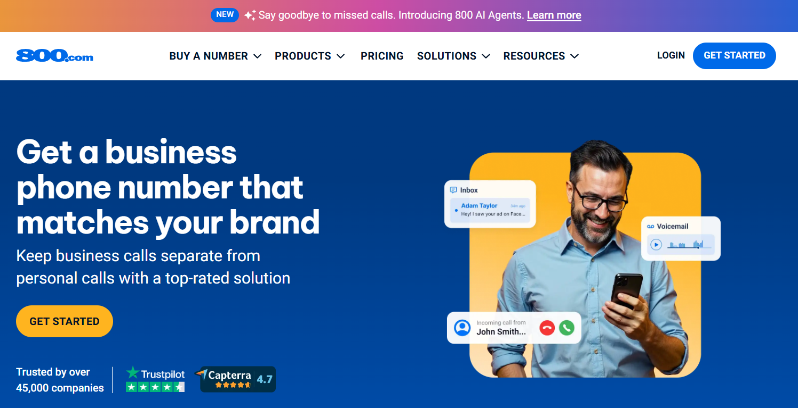
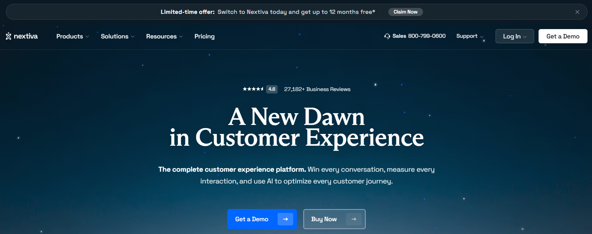
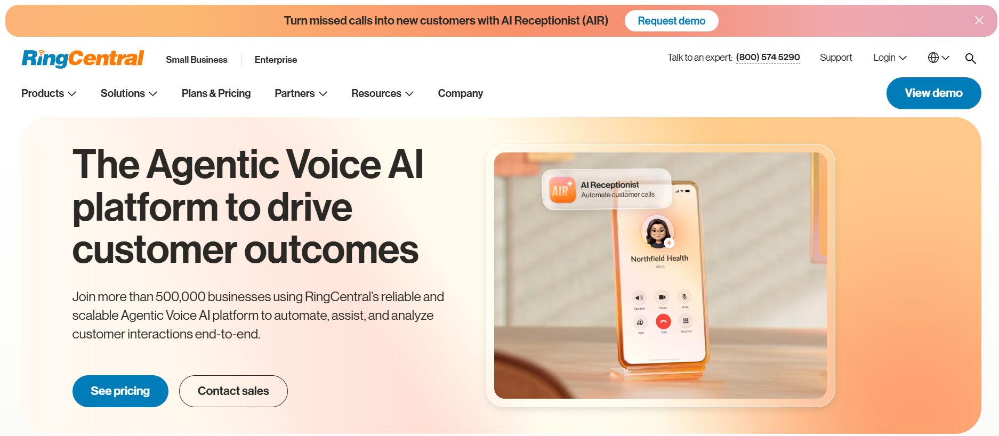
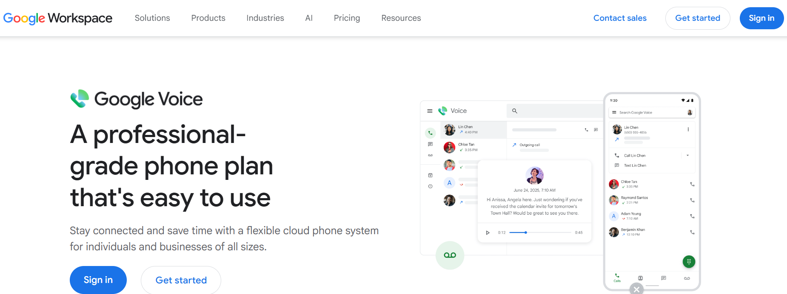

# 5 Best Toll-Free Service Providers for Businesses (2026)

You see them everywhere. **1-800-FLOWERS. 1-888-CONTACTS. 1-855-MATTRESS.**

Why do big brands use toll-free numbers? Because they work.

But here's the truth no one tells small business owners: **toll-free numbers are not just for corporations anymore.**

In 2026, a local plumber, a solo consultant, an e-commerce brand, and a growing agency can all get a professional toll-free number — and start looking like an established business overnight. Toll-free numbers build trust, encourage more inbound calls, support national reach, and make your customer service feel legitimate.

The only problem? Choosing the wrong provider can cost you time, money, and customers.

That's why this article compares the **5 Best Toll-Free Service Providers for Businesses** in 2026 — **800.com, Grasshopper, Nextiva, RingCentral, and Google Voice** — using real features, official pricing, honest pros and cons, and clear recommendations for each type of business.

> 🏆 **Spoiler:** 800.com ranks #1 overall. Here's exactly why.

## Quick Comparison Table — Best Toll-Free Service Providers 📊

| Provider | Best For | Toll-Free Numbers | Vanity Numbers | Local Numbers | Call Forwarding | SMS/Texting | Call Analytics | Mobile App | Starting Price | Best User Type |
|----------|----------|-------------------|----------------|---------------|-----------------|-------------|----------------|------------|----------------|----------------|
| **800.com** | Best overall | ✅ All prefixes | ✅ Marketplace | ✅ Yes | ✅ 3 types | ✅ Yes + SMS marketing | ✅ Advanced | ✅ Yes | $19/mo (annual) | Small–medium businesses |
| **Grasshopper** | Simple virtual phone | ✅ Yes | ✅ Limited | ✅ Yes | ✅ Yes | ✅ Basic texting | ❌ Limited | ✅ Yes | $14/mo (annual) | Solopreneurs, freelancers |
| **Nextiva** | VoIP + toll-free calling | ✅ Engage plan+ | ✅ Limited | ✅ Yes | ✅ Yes | ✅ Yes (plan-based) | ✅ Yes | ✅ Yes | $15/user/mo (annual) | Growing teams, support |
| **RingCentral** | Larger teams, UCaaS | ✅ 1 included | ✅ Add-on ($30 fee) | ✅ Yes | ✅ Advanced | ✅ Yes (capped) | ✅ Advanced | ✅ Yes | $20/user/mo (annual) | Mid-size to enterprise |
| **Google Voice** | Budget local calling | ❌ Not available | ❌ Not available | ✅ Local only | ✅ Basic | ✅ Basic | ❌ Limited | ✅ Yes | $10/user/mo + Workspace | Google Workspace users |

---

## 1. 800.com — Best Overall Toll-Free Number Provider 🏆

### 800.com Overview

**800.com** is the #1 toll-free service provider for businesses in 2026 — and it earns that ranking by focusing on exactly one thing: helping businesses get professional phone numbers backed by powerful communication features.

Unlike general VoIP platforms that treat toll-free numbers as an add-on, 800.com was built around business phone numbers from day one. That specialization shows in the depth of number options, the ease of the setup process, and the quality of features included with every plan.

  

800.com offers:
- **Toll-free numbers** across all major prefixes (800, 888, 877, 866, 855, 844, 833)
- **Vanity numbers** — including a dedicated Vanity Marketplace for premium options
- **Local numbers** tied to specific area codes
- **Premium numbers** for high-impact advertising
- **Canadian numbers** for businesses serving Canada
- **Number porting** — bring your existing number to 800.com

### Key Features of 800.com

| Feature | What It Does | Why It Matters |
|---------|-------------|----------------|
| 📞 Toll-Free Numbers | All major prefixes available | National credibility, free calls for customers |
| 🌟 Vanity Numbers | Spell your brand on a keypad | Memorable advertising, better brand recall |
| 📍 Local Numbers | Area code-specific numbers | Local trust for city-based businesses |
| 💎 Premium Numbers | Memorable digit sequences | High-impact TV, radio, billboard ads |
| 🇨🇦 Canadian Numbers | Canadian market access | Cross-border business communication |
| 🔁 Number Porting | Transfer existing number | Keep your brand, switch providers |
| 📲 Call Forwarding | Standard, sequential, simultaneous | Never miss a call, flexible routing |
| 🌐 VoIP / WiFi Calling | Calls over internet connection | No landline needed, works anywhere |
| 💬 Business Texting | Send/receive SMS from business number | Professional text communication |
| 📢 SMS Marketing | Run personalized text campaigns | High open-rate customer engagement |
| 📊 Call Analytics | Track volume, duration, source | Understand what drives calls |
| 🎯 Call Tracking | Attribute calls to specific campaigns | Measure ad ROI accurately |
| 📱 Desktop & Mobile Apps | Manage everything from any device | Remote-ready business communication |
| 📥 Voicemail Boxes | Dedicated voicemail per number/extension | Nothing falls through the cracks |
| 📝 Voicemail Transcription | Auto-convert voicemails to text | Read messages quickly, anywhere |
| 🎙️ Call Recording | Record calls automatically | Training, compliance, dispute resolution |
| ⚙️ API & Webhook Access | Integrate with CRM and custom tools | Automated workflows and data sync |
| 🤖 AI Agents | AI-powered virtual assistants | 24/7 automated customer interactions |
| 🧠 800 Intelligence™ | AI call summaries, scores, follow-ups | Faster sales follow-up, better call quality |
| 🆔 Enhanced Caller ID | See caller details before answering | Personalize every customer conversation |

### 800.com Pricing

> ⚠️ Always check the official 800.com pricing page. for current rates.

| Plan | Monthly Billing | Annual Billing | Numbers | Minutes | Users | Extensions |
|------|-----------------|----------------|---------|---------|-------|------------|
| **Startup** | $23/mo | $19/mo | 1 | 1,000 min | 1 | 1 |
| **Small Business** ⭐ | $59/mo | $49/mo | 3 | Unlimited* | 3 | 3 |
| **Unlimited** | $117/mo | $99/mo | 5 | Unlimited* | Unlimited | Unlimited |

*Subject to Fair Usage Policy. Annual billing saves 15%. No setup fees. No long-term contracts. 30-day money-back guarantee on all plans.

### 800.com Pros & Cons

| ✅ Pros | ❌ Cons |
|---------|---------|
| Strongest toll-free and vanity number focus | Startup plan capped at 1,000 minutes |
| All-inclusive features on every plan | Premium/vanity numbers cost more |
| Vanity Marketplace for premium numbers | Advanced AI features may vary by plan |
| Three call forwarding types included | Support hours Mon–Fri, 9am–6pm ET only |
| SMS marketing and call analytics built in | Not ideal for free/personal-only calling |
| AI Agents and 800 Intelligence™ | Annual billing needed for best rate |
| No setup fees, no contracts | |
| 30-day money-back guarantee | |
| G2-recognized: Easiest Setup, Easiest to Use | |

### Who Should Use 800.com?

800.com is the right choice for:

- ✅ **Small businesses** that want professional toll-free presence
- ✅ **Agencies** tracking call performance from marketing campaigns
- ✅ **Sales teams** that need call analytics and lead attribution
- ✅ **Customer support teams** managing inbound call routing
- ✅ **Law firms** that need credibility and call recording
- ✅ **Healthcare clinics** needing local or toll-free with voicemail transcription
- ✅ **Home service businesses** running local and vanity number campaigns
- ✅ **E-commerce brands** adding phone support to the customer experience
- ✅ **Lead generation businesses** tracking which channels drive phone calls

### Why 800.com Ranks #1

800.com wins the top spot because it is the only provider in this comparison that treats the phone number itself as the core product — not an afterthought bolted onto a video conferencing or team messaging platform.

- **Widest number variety** — toll-free, vanity, local, premium, Canadian, porting
- **All features included from the base plan** — no nickel-and-diming for basic functionality
- **AI tools built in** — 800 Intelligence™ and AI Agents are competitive advantages no other provider in this list matches at the SMB level
- **Best for businesses that drive revenue through phone calls** — the platform was built for exactly this use case

---

## 2. Grasshopper — Best for Simple Virtual Phone Numbers 🌱

### Grasshopper Overview

Grasshopper is the friendly, straightforward virtual phone system built for **entrepreneurs, solopreneurs, and very small teams** who want a professional business number without complexity.

If you're a freelancer, a solo consultant, or a small shop with 1–3 people, Grasshopper gives you everything you need to separate your business calls from your personal phone — without learning a complicated new platform.

Grasshopper does not offer advanced AI features, call analytics dashboards, or SMS marketing. What it does offer is **simple, reliable, affordable virtual phone service** that works out of the box.

  

### Key Features of Grasshopper

- 📞 **Toll-Free numbers** — 800, 888, 877, 866, 855, 844 prefixes available
- 📍 **Local numbers** — area code-specific numbers for local businesses
- ✨ **Vanity numbers** — available but with limited selection compared to 800.com
- 🔁 **Number porting** — bring your existing number at no extra cost
- 📲 **Call forwarding** — forward calls to your existing mobile or landline
- #️⃣ **Extensions** — route to team members or departments
- 💬 **Business texting** — unlimited domestic texting on all plans
- 📥 **Voicemail** — standard voicemail with transcription
- 📱 **Mobile & desktop apps** — iOS, Android, and desktop supported
- 📠 **Virtual fax** — receive faxes digitally
- 👋 **Custom greetings** — record your own professional greeting

### Grasshopper Pricing

> ⚠️ Check grasshopper.com for the latest official rates.

| Plan | Annual Billing | Monthly Billing | Numbers | Extensions | Users |
|------|----------------|-----------------|---------|------------|-------|
| **True Solo** | $14/mo | $18/mo | 1 number | 1 extension | 1 user |
| **Solo Plus** | $25/mo | $32/mo | 1 number | 3 extensions | Unlimited |
| **Small Business** | $55/mo | $70/mo | 4 numbers | Unlimited | Unlimited |

All plans include unlimited domestic calls and texting. Extra numbers: $9/mo each. Extra extensions: $3–$5/mo each.

### Grasshopper Pros & Cons

| ✅ Pros | ❌ Cons |
|---------|---------|
| Very simple setup — beginner-friendly | No advanced call analytics |
| Affordable entry price at $14/mo | No SMS marketing features |
| Supports toll-free, local, and vanity numbers | Limited vanity number selection vs 800.com |
| Number porting included at no extra cost | Not designed for growing or larger teams |
| Unlimited domestic calls and texting | Extra numbers cost $9/mo each |
| Mobile and desktop apps included | No AI features |
| 7-day free trial available | Not a true VoIP — relies on carrier networks |

### Who Should Use Grasshopper?

- ✅ **Freelancers** who want a separate business line
- ✅ **Solopreneurs** who need professional-sounding call handling
- ✅ **Very small service businesses** (1–3 people)
- ✅ **Local consultants** who want a simple phone presence
- ✅ **Side-hustle owners** separating business from personal calls

### Where Grasshopper Falls Short

Grasshopper is not the right choice if you need:
- **Call analytics or tracking** — Grasshopper offers minimal reporting
- **SMS marketing** — not supported
- **AI-powered features** — not available
- **Vanity number marketplace** — 800.com's selection is far broader
- **Scaling beyond a small team** — Grasshopper's architecture wasn't built for growing organizations

---

## 3. Nextiva — Best for VoIP + Toll-Free Calling 📡

### Nextiva Overview

Nextiva is a full-featured VoIP and customer communication platform that goes well beyond just a phone number. It's built for **growing businesses and customer-facing teams** that need reliable calling, team communication, and customer interaction tools — all in one place.

Toll-free numbers are available on Nextiva, but they're not the platform's primary focus. If you need a toll-free number *plus* a robust VoIP system, call queues, team messaging, and customer communication tools, Nextiva is an excellent choice.

  

### Key Features of Nextiva

- 📞 **Toll-free number support** — included on Engage plan and above (with 2,000 free inbound minutes/mo)
- 🌐 **VoIP calling** — inbound and outbound voice over internet
- 📲 **Call forwarding** — intelligent call routing and rules
- 📋 **Auto-attendant / IVR** — route callers to the right team
- 👥 **Call queues** — manage high-volume inbound calls
- 💬 **Team messaging** — internal communication built in
- 📊 **Advanced reporting** — available on Engage plan and above
- 🎙️ **Call recording** — included on Engage plan and above
- 📱 **Mobile and desktop apps** — available on all plans
- 🔗 **CRM/customer communication tools** — available on higher plans

### Nextiva Pricing

> ⚠️ Nextiva uses per-user pricing. Rates change with billing cycle and team size. Always check nextiva.com for current rates.

| Plan | Annual Billing | Monthly Billing | Toll-Free | SMS/User/mo | Call Recording | Best For |
|------|----------------|-----------------|-----------|-------------|----------------|----------|
| **Core** | $15/user/mo | $23/user/mo | ❌ Not included | 100 | ❌ Not included | Small teams, basic calling |
| **Engage** | $24/user/mo | $50/user/mo | ✅ 2,000 min/mo | 500 | ✅ Yes | Growing teams, support |
| **Power Suite CX** | $75/user/mo | Contact sales | ✅ Advanced | Custom | ✅ Yes | Contact centers |

**Important note:** Toll-free numbers are only included starting from the Engage plan. The Core plan does not include a toll-free number. Overage charges on toll-free minutes apply at ~$0.025/minute beyond the 2,000 included in Engage.

### Nextiva Pros & Cons

| ✅ Pros | ❌ Cons |
|---------|---------|
| Strong VoIP features for growing teams | Toll-free not included in Core plan |
| Auto-attendant and call queue management | Per-user pricing adds up with team size |
| Call recording on Engage and above | Core plan limited to 100 SMS/user/mo |
| Team messaging built in | Complex for businesses only needing a toll-free number |
| Scalable from SMB to enterprise | Overage fees apply beyond 2,000 toll-free minutes |
| 24/7 customer support | Not a vanity number marketplace |
| Good analytics and reporting | No AI features at SMB level |

### Who Should Use Nextiva?

- ✅ **Growing businesses** that need full VoIP + toll-free together
- ✅ **Customer support teams** managing high inbound call volume
- ✅ **Sales teams** needing call routing, queues, and team messaging
- ✅ **Businesses replacing a traditional phone system** with VoIP
- ✅ **Teams that need call recording** for QA and compliance

### Where Nextiva Falls Short

If you're a small business that just needs a **professional toll-free or vanity number**, Nextiva is probably more than you need — and the per-user pricing structure means costs scale quickly as your team grows. For simple toll-free number needs, **800.com** or **Grasshopper** will get you set up faster at a lower cost.

---

## 4. RingCentral — Best for Larger Teams & Unified Communications 🏢

### RingCentral Overview

RingCentral is one of the most recognized names in business communications. It's a **full unified communications platform** — phone, messaging, video meetings, analytics, and more — all wrapped in one enterprise-grade system.

For businesses that need more than just a toll-free number — teams that need video conferencing, team messaging, advanced call routing, and AI communication tools all in one platform — RingCentral is a top contender.

Toll-free numbers are included with every RingCentral plan. However, RingCentral's toll-free minute limits are relatively low on entry-level plans (100 minutes on Core), and advanced features like vanity numbers come with additional fees.

  

### Key Features of RingCentral

- 📞 **Toll-free number** — 1 included per account on all plans
- 🌐 **Business calling** — unlimited domestic calling
- 📲 **Call routing** — advanced routing rules and call queues
- 👋 **Auto-attendant / IVR** — multi-level menus available
- 🎙️ **Call recording** — included on Advanced and Ultra plans
- 💬 **Team messaging** — integrated chat for internal teams
- 🎥 **Video meetings** — 100–200 participants depending on plan
- 📊 **Analytics and reporting** — Business Analytics Pro on Ultra
- 📱 **Mobile and desktop apps** — full-featured on all platforms
- 🤖 **AI communication features** — AI Receptionist, RingSense (separate add-ons)

### RingCentral Pricing

> ⚠️ Always check ringcentral.com for current rates. Add-on fees, regulatory charges, and usage overages will increase total cost.

| Plan | Annual Billing | Monthly Billing | Toll-Free Minutes | SMS/User/mo | Video Participants | Best For |
|------|----------------|-----------------|-------------------|-------------|-------------------|----------|
| **Core** | $20/user/mo | $30/user/mo | 100 min | 25 | 100 | Small teams |
| **Advanced** | $25/user/mo | $35/user/mo | 1,000 min | 100 | 100 | Growing teams |
| **Ultra** | $35/user/mo | $45/user/mo | 10,000 min | 200 | 200 | Large organizations |

Additional toll-free numbers: $4.99/mo each. Vanity numbers: $30 activation fee + $4.99 setup fee. Annual billing saves approximately 33% vs monthly.

### RingCentral Pros & Cons

| ✅ Pros | ❌ Cons |
|---------|---------|
| Full unified communications — call, message, meet | 100 toll-free minutes on Core is very limited |
| 1 toll-free number included on all plans | SMS capped (25–200/user/mo depending on plan) |
| Strong call routing and auto-attendant | Vanity numbers require extra activation fee |
| Video meetings built in (no extra tool needed) | Complex and potentially expensive for small teams |
| Advanced analytics on Ultra plan | AI features are separate paid add-ons |
| Scalable for large organizations | Overage and compliance fees increase real cost |
| 14-day free trial | May feel overwhelming if you only need a phone number |

### Who Should Use RingCentral?

- ✅ **Larger teams** that need calling, messaging, and video in one platform
- ✅ **Multi-location businesses** needing centralized communication
- ✅ **Enterprises** with complex routing, compliance, and reporting needs
- ✅ **Teams that need video conferencing** built into the same system as their phone
- ✅ **Businesses replacing multiple communication tools** with a single platform

### Where RingCentral Falls Short

If your primary need is a **toll-free or vanity number** with solid call forwarding and business texting, RingCentral is more than you need — and the per-user pricing model means you'll be paying for video conferencing and team messaging features you may never use. For toll-free-first businesses, **800.com** delivers better value at a lower cost.

---

## 5. Google Voice — Best Budget Option for Local Business Calling 💸

### Google Voice Overview

Google Voice is a business phone option tied to **Google Workspace**. It's designed for small teams and individuals who want a simple, affordable business phone number integrated with Google's ecosystem — Gmail, Calendar, Meet, and Drive.

It's affordable, easy to set up, and works well for businesses already using Google Workspace.

But there's a critical limitation every business owner needs to understand before choosing Google Voice.

  

 

### ⚠️ Important Note: Google Voice Does NOT Offer Toll-Free Numbers

This is not a minor limitation — **Google Voice does not offer toll-free numbers on any plan.** You cannot get an 800, 888, 877, 866, 855, 844, or 833 number through Google Voice. You cannot even port an existing toll-free number into the service.

Google Voice assigns **local numbers only.** If you specifically need a toll-free number, a vanity number, or a national-presence phone number, Google Voice cannot meet that need. You should consider **800.com, Grasshopper, Nextiva, or RingCentral** instead.

With that clearly stated, here's what Google Voice **does** offer:

### Key Features of Google Voice

- 📍 **Local business numbers** — one number per user
- 📲 **Call forwarding** — forward to any phone
- 📝 **Voicemail transcription** — automatic on all plans
- 💬 **Text messaging** — basic SMS on paid plans
- 🔗 **Google Workspace integration** — connects with Gmail, Calendar, Meet
- 🌐 **Web and mobile access** — browser + iOS/Android apps
- 👋 **Auto-attendant** — available on Standard and Premier plans only
- 👥 **Ring groups** — available on Standard and Premier plans only

### Google Voice Pricing

> ⚠️ Google Voice requires a **Google Workspace subscription** (starting at $7/user/mo) in addition to the Voice plan cost. The true entry cost is approximately $17/user/mo. Check voice.google.com for current rates.

| Plan | Voice Cost | + Workspace | Approx. Total | Auto-Attendant | Call Recording | Users |
|------|------------|-------------|---------------|----------------|----------------|-------|
| **Starter** | $10/user/mo | $7+/user/mo | ~$17+/user/mo | ❌ | ❌ | Up to 10 |
| **Standard** | $20/user/mo | $7+/user/mo | ~$27+/user/mo | ✅ | ❌ | Unlimited |
| **Premier** | $30/user/mo | $7+/user/mo | ~$37+/user/mo | ✅ | ✅ | Unlimited |

### Google Voice Pros & Cons

| ✅ Pros | ❌ Cons |
|---------|---------|
| Affordable base price | **No toll-free numbers — at all** |
| Seamless Google Workspace integration | **No vanity numbers** |
| Easy to set up for Google users | Requires Workspace subscription — hidden true cost |
| Good voicemail transcription | Auto-attendant only on Standard and above |
| Voicemail and call forwarding included | Call recording only on Premier ($30/user/mo) |
| Works on mobile and web | No CRM integrations outside Google ecosystem |
| Simple and clean interface | Limited business features for growing teams |
| | No desktop app |
| | No toll-free number porting |

### Who Should Use Google Voice?

- ✅ **Freelancers** who want a free or cheap business number
- ✅ **Small teams** already using Google Workspace as their primary tool
- ✅ **Solo founders** who need a simple local number to separate work from personal
- ✅ **Budget-conscious businesses** with minimal call volume and no toll-free requirements

### Where Google Voice Falls Short for Toll-Free Needs

If your business needs any of the following, Google Voice is not the right choice:

- ❌ A toll-free (800/888/877/etc.) number for national credibility
- ❌ A vanity number for advertising and brand recall
- ❌ Number porting for an existing toll-free number
- ❌ Advanced business phone features like SMS marketing, call analytics, or AI tools
- ❌ More than one number per user without adding extra Workspace seats

For any of these needs, **800.com** is the recommended starting point.

## Why Your Business May Need a Toll-Free Number 🚀
 
Before comparing providers, let's make sure a toll-free number is actually the right move for your business.
 
### Practical Benefits of a Toll-Free Number
 
- **Builds a professional image** — A 1-800 number signals you're an established business, not just a freelancer with a cell phone
- **Makes customer support easier** — Customers call more freely when it's free for them
- **Helps national reach** — A toll-free number isn't tied to a geographic area code, so it works everywhere in the country
- **Improves brand trust** — Especially for industries where credibility matters (legal, healthcare, finance)
- **Useful for sales calls** — Sales teams using toll-free numbers see better answer rates than calls from unrecognized mobile numbers
- **Helps with call tracking** — Assign different toll-free numbers to different ads or campaigns and track exactly which marketing channels drive calls
- **Better for campaigns and ads** — TV, radio, and billboard ads work best with memorable 1-800 numbers
### Who Specifically Benefits Most?
 
| Business Type | Why Toll-Free Helps |
|---------------|---------------------|
| **Law firms** | Builds client trust and national credibility |
| **Healthcare clinics** | Patients are more likely to call a professional number |
| **Real estate businesses** | Toll-free numbers on yard signs and ads drive more calls |
| **Home service businesses** | Local and toll-free numbers both improve call volume |
| **E-commerce stores** | Phone support with a toll-free number reduces cart abandonment |
| **Agencies** | Toll-free numbers make the business look larger and more established |
| **Customer support teams** | Inbound call volume increases when calls are free for customers |

## 800.com vs Grasshopper vs Nextiva vs RingCentral vs Google Voice 🔥

### Feature-by-Feature Comparison

### Best for Toll-Free Numbers 🏆
**Winner: 800.com**

800.com was built specifically for toll-free numbers. It supports all prefixes (800, 888, 877, 866, 855, 844, 833), activates random toll-free numbers within 1–2 hours, and includes a dedicated Vanity Marketplace for premium numbers. No other provider in this comparison matches this depth of toll-free focus.

### Best for Vanity Numbers ✨
**Winner: 800.com** (with Grasshopper as a distant second)

800.com's Vanity Marketplace is purpose-built for businesses that want memorable advertising numbers. Grasshopper offers vanity numbers but with a much smaller selection. RingCentral offers vanity numbers as an add-on with a $30 activation fee. Google Voice does not offer vanity numbers at all.

### Best for Simple Setup 🛠️
**Winner: Grasshopper or Google Voice**

For absolute simplicity, Grasshopper and Google Voice are the easiest to get started with. Both have clean interfaces and straightforward onboarding. Grasshopper wins if you specifically need a toll-free option; Google Voice wins if you're already in the Google ecosystem and only need a local number.

### Best for VoIP Features 📡
**Winner: Nextiva**

Nextiva leads in VoIP-specific functionality — call queues, auto-attendant, team messaging, and reliable VoIP infrastructure. It's the strongest choice when you need a full business phone system, not just a number.

### Best for Larger Teams 🏢
**Winner: RingCentral**

For organizations that need phone + video + messaging + advanced analytics in one unified platform, RingCentral is the most complete solution. It scales to hundreds of users with enterprise-grade features.

### Best Budget/Local Number Option 💸
**Winner: Google Voice**

For pure affordability and local number access — especially for Google Workspace users — Google Voice is the cheapest option. But only if you do not need toll-free numbers.

### Summary Comparison Table

| Category | Winner | Why |
|----------|--------|-----|
| Best Toll-Free Numbers | **800.com** | All prefixes, fastest activation, widest selection |
| Best Vanity Numbers | **800.com** | Dedicated marketplace, 1-800-YOURBRAND style |
| Best Simple Setup | **Grasshopper** | Beginner-friendly, flat pricing |
| Best VoIP Features | **Nextiva** | Call queues, IVR, team messaging |
| Best for Large Teams | **RingCentral** | Full UCaaS — call, video, message |
| Best Budget Option | **Google Voice** | Lowest cost (local only) |
| Best AI Features | **800.com** | 800 Intelligence™, AI Agents |
| Best Call Analytics | **800.com / RingCentral** | Both strong; 800.com better for SMBs |

---

## How to Choose the Best Toll-Free Service Provider 🤔

### Check Number Availability First

Before choosing a provider, search for your preferred number. Popular <a href="https://en.wikipedia.org/wiki/Vanity_telephone_number" target="_blank" rel="nofollow noopener">Vanity</a> keywords and specific area codes may already be taken. 800.com's search tool lets you check availability immediately. If a specific number matters to your brand, verify it's available on the platform before committing.

### Compare Monthly vs Annual Pricing

Annual billing typically saves 15–33% depending on the provider. If you're confident you'll use the service long-term, annual billing is almost always the better deal. Monthly billing offers flexibility but costs more.

### Review Call Minutes and SMS Limits

- **800.com Startup**: 1,000 minutes cap — check your call volume
- **RingCentral Core**: Only 100 toll-free minutes — very low for active businesses
- **Nextiva Engage**: 2,000 toll-free minutes — better, but overages apply
- **Grasshopper**: Unlimited domestic calls — no minute cap

If your business handles significant inbound call volume on a toll-free number, the RingCentral Core plan's 100-minute limit will be a real problem.

### Check Call Forwarding and Routing Needs

- **Standard forwarding**: Route all calls to one number (basic — all providers)
- **Sequential forwarding**: Try numbers one at a time (800.com, Grasshopper)
- **Simultaneous forwarding**: Ring all numbers at once (800.com)
- **Call queues and advanced routing**: Nextiva, RingCentral

Choose based on how your team handles inbound calls.

### Decide If You Need Vanity Numbers

If you're running ads — especially radio, TV, or billboards — a vanity number is worth its cost many times over. Customers remember 1-800-PLUMBER far longer than they remember a string of digits.

**800.com** has the strongest vanity number selection. If this matters to your business, it should significantly influence your choice.

### Review Mobile and Desktop App Support

All five providers offer mobile apps. For remote teams and businesses where staff are frequently out of the office, confirming that the app handles calls cleanly on both iOS and Android is essential. 800.com, Grasshopper, Nextiva, and RingCentral all offer solid apps.

### Check Analytics and Call Tracking

If you run marketing campaigns and need to know which ad, which channel, or which campaign is driving phone calls — call analytics and tracking are non-negotiable.

**800.com** and **RingCentral** offer the strongest call analytics at the SMB and enterprise level respectively. Grasshopper and Google Voice are weak in this area.

### Compare Number Porting Options

If you already have a business number your customers know, you'll want to port it rather than start fresh. All five providers support number porting for local and toll-free numbers — **except Google Voice, which cannot port toll-free numbers at all.**

---

## Toll-Free Number Features You Should Look For 🛠️

When evaluating any toll-free provider, look for these essential features:

- 📲 **Call forwarding** — Route calls to any device; ideally standard, sequential, and simultaneous
- 🎤 **Auto-attendant / IVR** — Professional "Press 1 for Sales" menus
- 💬 **Business texting** — SMS from your toll-free number
- 📝 **Voicemail transcription** — Read messages without listening
- 🎙️ **Call recording** — For training, compliance, and QA
- 📊 **Call analytics** — Track who calls, when, how long, and from where
- 📱 **Mobile and desktop apps** — Access your business number from anywhere
- 🔁 **Number porting** — Transfer your existing number seamlessly
- ✨ **Vanity number search** — Find a number that spells your brand
- ⚙️ **CRM/API integrations** — Connect your phone data to your other business tools

---

## Common Mistakes to Avoid When Choosing a Toll-Free Provider ⚠️

These are the most expensive mistakes businesses make when picking a provider:

- ❌ **Choosing only on price** — The cheapest plan often has severe minute, SMS, or feature limits
- ❌ **Ignoring toll-free minute limits** — RingCentral Core's 100 minutes will run out fast for active businesses
- ❌ **Not checking vanity number availability** — Popular keywords may be taken; verify before committing
- ❌ **Forgetting number porting requirements** — Check your current provider allows outbound porting
- ❌ **Skipping call routing setup** — Configure forwarding, voicemail, and greetings before going live
- ❌ **Not testing voicemail and forwarding** — Always test call flows after signup
- ❌ **Buying features your team won't use** — Don't pay for video conferencing if you only need a phone number
- ❌ **Choosing Google Voice when you need a toll-free number** — Google Voice only offers local numbers; this is a dealbreaker for many businesses

---

## Which Toll-Free Provider Is Best for Your Business Type? 👥

| Business Type | Best Provider | Why |
|---------------|---------------|-----|
| **Small businesses** | 800.com | Best number variety, all-inclusive features |
| **Agencies** | 800.com | <a href="https://www.callloop.com/blog/call-tracking-numbers" rel="nofollow noopener">call tracking</a>, analytics, vanity numbers for client campaigns |
| **Local service businesses** | 800.com or Grasshopper | Local + toll-free options, easy setup |
| **Healthcare clinics** | 800.com | Voicemail transcription, local/toll-free, fax support |
| **Law firms** | 800.com | Toll-free credibility, call recording, call screening |
| **E-commerce brands** | 800.com or Nextiva | Phone support + SMS marketing |
| **Sales teams** | 800.com or Nextiva | Call analytics, AI tools, call routing |
| **Customer support teams** | Nextiva or RingCentral | Call queues, IVR, team messaging |
| **Large companies** | RingCentral | Full UCaaS — phone, video, message |
| **Budget users (local only)** | Google Voice | Cheapest entry cost, Google Workspace integration |
| **Solopreneurs/freelancers** | Grasshopper | Simplest setup, affordable flat pricing |

---

## Pros & Cons of Using a Toll-Free Number Provider ⚖️

| ✅ Pros | ❌ Cons |
|---------|---------|
| Professional business image | Monthly subscription cost |
| Builds customer trust nationally | Minute limits may apply on entry plans |
| Nationwide reach beyond your area code | Vanity numbers may cost more |
| Improved call tracking for ad campaigns | Not always needed for local-only businesses |
| Useful for advertising and brand recall | Some providers are more complex than others |
| Better for customer support — free for callers | Number porting takes time (~2 weeks average) |
| More flexible than using a personal phone | Premium vanity numbers have higher pricing |
| Voicemail, SMS, and forwarding all in one | Overage fees if toll-free minute limits exceeded |

---

## Final Verdict — Which Toll-Free Provider Should You Choose? ✅

Here's the honest bottom line for the **5 Best Toll-Free Service Providers for Businesses** in 2026:

| Recommendation | Provider | Why |
|----------------|----------|-----|
| 🏆 **Best Overall** | **800.com** | Best number variety, all features included, AI tools, call analytics |
| 🌱 **Best Simple Virtual Phone** | **Grasshopper** | Easy setup, affordable, good for solopreneurs |
| 📡 **Best VoIP + Toll-Free** | **Nextiva** | Full VoIP platform, call queues, team messaging |
| 🏢 **Best for Larger Teams** | **RingCentral** | Complete UCaaS — call, video, message, analytics |
| 💸 **Best Budget/Local Option** | **Google Voice** | Cheapest entry cost — but no toll-free numbers |

### The Short Answer

If you are a small or medium business that relies on phone calls for sales, support, or lead generation — **start with 800.com.** It gives you the most number options, the best features for the price, and AI-powered tools that are genuinely ahead of what competitors offer at the same price point.

If you only need a simple virtual phone number and have zero need for analytics or marketing features — **Grasshopper is your best alternative.**

If you need a full business phone system with VoIP, team messaging, and call center features — **Nextiva or RingCentral** will serve you better than a number-only provider.

If you're a Google Workspace user who only needs a local number for basic business communication — **Google Voice is the lowest-cost entry point**, but go in knowing it cannot provide a toll-free number.

---

**Related Guides**

- [How to Get a Toll-Free Number for Your Business](./how-to-get-toll-free-number-for-business.md)
- [What Is a Vanity Number and How to Get One](./what-is-a-vanity-number-and-how-to-get-one.md)
- [800.com Review 2026](./800-com-review.md)
- [800.com Coupon Code 2026](./README.md)

## FAQs — Best Toll-Free Service Providers ❓

### 1. Which is the best toll-free number provider for small businesses?

**800.com** is the best overall choice for small businesses. It offers the widest range of number types (toll-free, vanity, local, premium, Canadian), all communication features from the base plan, and pricing starting at $19/mo on annual billing.

### 2. Is 800.com better than Grasshopper?

For businesses that need call analytics, SMS marketing, vanity number selection, or AI features — yes, **800.com** is stronger. For very small teams or solopreneurs who just want a basic toll-free or local number with simple forwarding, **Grasshopper** may be simpler and sufficient.

### 3. Does Google Voice offer toll-free numbers?

**No.** Google Voice does not offer toll-free numbers on any plan, and it cannot port existing toll-free numbers. It is a local-number-only service. If you need a toll-free number, use **800.com, Grasshopper, Nextiva, or RingCentral**.

### 4. Can I port my existing toll-free number?

Yes — **800.com, Grasshopper, Nextiva, and RingCentral** all support toll-free number porting. The average porting time is approximately 2 weeks. **Google Voice does not support toll-free number porting.**

### 5. Which provider is best for vanity numbers?

**800.com** is the strongest choice for vanity numbers. It has a dedicated Vanity Marketplace with premium options specifically curated for advertising campaigns. Grasshopper offers vanity numbers but with more limited selection. RingCentral supports vanity numbers as an add-on with a $30 activation fee.

### 6. Which toll-free provider is cheapest?

- **Google Voice** starts at ~$10/user/mo — but requires Google Workspace and offers **no toll-free numbers**
- **Grasshopper** starts at $14/mo (annual) — includes toll-free numbers
- **800.com** starts at $19/mo (annual) — includes toll-free + full features
- **Nextiva** starts at $15/user/mo — toll-free only on Engage plan ($24/user/mo)
- **RingCentral** starts at $20/user/mo — 100 toll-free minutes only on Core plan

For the best **value** on a true toll-free number with full features, **800.com's Small Business plan at $49/mo** (annual) is hard to beat.

### 7. Do toll-free numbers work with mobile phones?

Yes. All five providers support mobile call forwarding. With **800.com, Grasshopper, Nextiva, and RingCentral**, you can receive calls on your mobile phone through their apps or direct forwarding. Your customers call the toll-free number; it rings on your mobile.

### 8. Are toll-free numbers worth it in 2026?

Absolutely — for any business that relies on inbound phone calls. Toll-free numbers improve answer rates, build credibility, support national reach, and enable call tracking for marketing campaigns. For businesses where phone calls directly generate revenue or support customers, a toll-free number pays for itself quickly.
