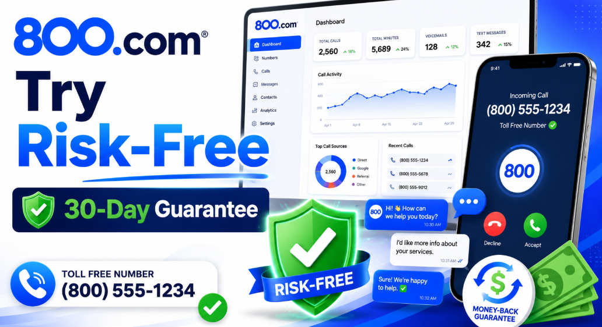
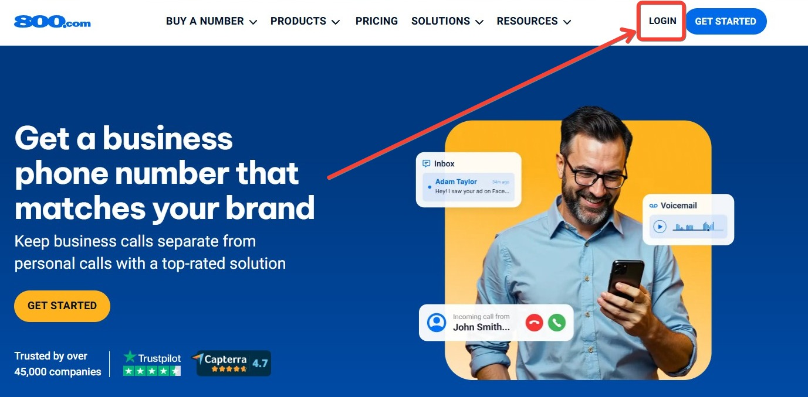
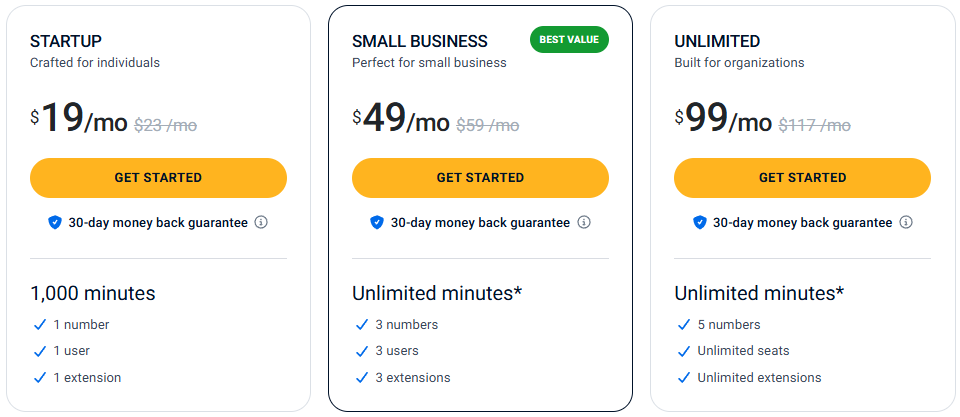

# 800.com Free Trial: Test All Features Risk-Free for 30 Days

🚀 Looking for a way to test 800.com before committing to a long-term plan?

The good news is that 800.com offers a 30-day money-back guarantee, giving businesses a risk-free way to explore its toll-free numbers, vanity numbers, call tracking, business texting, and advanced phone system features. 

  

Whether you're a small business owner, marketing agency, or growing team, this trial period can help you determine if the platform fits your communication needs.

In this guide, you'll learn how the 800.com free trial works, what features you can access, potential limitations, pricing details, and the best ways to maximize your savings before subscribing. Plus, we'll show you how to combine the free trial with the latest 800.com deals and discounts for even greater value.

## 1. 800.com Free Trial — Quick Overview 🎉

Let's answer the most common question right up front.

**Does 800.com offer a free trial?**

Not in the traditional sense. 800.com does **not** offer a free trial where you sign up without paying and test the product for a few days.

What 800.com **does** offer is a **30-day money-back guarantee** on all plans. You pay upfront to start, but if you're not satisfied within the first 30 days, you can request a full refund of your initial charge — provided you haven't accumulated excessive usage during that period.

Here's the key difference at a glance:

| Feature                  | Traditional Free Trial     | 800.com 30-Day Guarantee     |
| ------------------------ | -------------------------- | ---------------------------- |
| Upfront Payment Required | ❌ No                       | ✅ Yes                        |
| Access to Full Features  | ✅ Yes                      | ✅ Yes                        |
| Risk of Losing Money     | ❌ None                     | ✅ Minimal (Refund Available) |
| Time Limit               | Varies (7–14 Days Typical) | 30 Days                      |
| Usage Restrictions       | Often Limited              | Subject to Fair Usage        |
| Credit Card Required     | Sometimes Not              | ✅ Yes                        |

Think of it this way: a free trial is "try before you pay." 800.com's guarantee is "pay, try everything, get your money back if it's not right." For most businesses, 30 days is more than enough time to evaluate a phone system. 💡

## 2. Does 800.com Really Have a Free Trial? 🤔

This is where a lot of confusion comes from — so let's be completely clear.

According to 800.com's **official support page**, here is their exact policy on trial periods:

> *"Because we offer the highest quality products at the best value, if you are not satisfied with our service, we will refund the initial charge, if requested, provided you have not accumulated excessive usage throughout the initial 30-day period."*

That's the official word directly from 800.com's support documentation. No traditional free trial. No "try without a credit card" option. Just a solid 30-day money-back policy.

**Why do people confuse this with a free trial?**

A few reasons:

- Marketing language like "risk-free" and "try for 30 days" sounds like a free trial
- 30 days is a longer window than most traditional free trials
- The full feature access during that 30 days feels like a proper trial
- Some competitor review sites inaccurately describe it as a free trial

The honest framing: 800.com's 30-day money-back guarantee is **better** than most 7-day free trials in the industry — because you get full, unrestricted access to everything for a full month. You're not testing a limited demo. You're running your actual business on it. 📞

## 3. 800.com 30-Day Money-Back Guarantee Explained 💸

Here's how the guarantee actually works in practice.

### How It Works

You sign up, pay for your chosen plan, and immediately get full access to all features. From that point, you have **30 days** to evaluate the platform. If you decide it's not right for your business, contact 800.com's support team and request a refund of your initial charge.

### Who Qualifies

All new customers who sign up for any paid Business Phone Plan qualify for the 30-day money-back guarantee. The guarantee applies to your initial signup charge.

### Refund Eligibility

The refund is available if you have **not accumulated excessive usage** during the first 30 days. This is the key condition. If you've been using the platform heavily — processing thousands of minutes, sending large volumes of SMS, or using premium features extensively — the refund eligibility may be affected.

For most businesses who are genuinely evaluating the platform rather than exploiting the guarantee, this condition isn't a practical concern.

### Summary Table

| Detail                        | Information                            |
| ----------------------------- | -------------------------------------- |
| Guarantee Period              | 30 Days from Signup                    |
| Applies To                    | Initial Charge on Eligible Plans       |
| Refund Condition              | Must Comply with Fair Usage Policies   |
| How to Claim                  | Contact 800.com Support                |
| Credit Card Required to Start | ✅ Yes                                  |
| Available on All Plans        | Check Current Terms                    |
| Call Tracking Plans Included  | Check Official Site for Current Policy |

### Important Limitations to Know

- The guarantee covers your **initial charge** — not future renewal charges if you forget to cancel
- "Excessive usage" is not publicly defined with a specific number — use the platform genuinely for evaluation
- Vanity and premium number costs may have separate terms — verify before purchasing
- The guarantee is for **new customers** — it doesn't apply to plan upgrades or renewals

> ⚠️ Always check the official 800.com support page for the most current guarantee terms before signing up.

## 📌 How to Start Your 800.com Risk-Free Trial Experience

### Step 1 — Visit the Official 800.com Website

Head over to the official 800.com website and click **"Get Started"**. This is where you'll begin the signup process and explore the available toll-free number options and business phone plans.

  

### Step 2 — Search for a Toll-Free or Vanity Number

Use the built-in search tool to find an available number for your business. You can choose a traditional toll-free number or browse vanity numbers if branding is important for your marketing campaigns.

  

### Step 3 — Choose the Right Plan

Review the available plans and select the one that matches your business needs. Compare call minutes, users, extensions, texting features, and other tools before continuing.

  

### Step 4 — Create Your Account

Enter your contact information and business details to create your account. Follow the setup instructions and review your selected plan before proceeding to checkout.

### Step 5 — Complete Your Purchase

Choose your preferred number and finalize the signup process. Since 800.com operates with a 30-day money-back guarantee, you'll have an opportunity to evaluate the platform after activation.

  

### Step 6 — Test All Features During the First 30 Days

Once your account is active, start exploring the platform's key features:

* ✅ Toll-free calling
* ✅ Business texting
* ✅ Call forwarding
* ✅ Voicemail and transcription
* ✅ Call analytics
* ✅ AI Agents and 800 Intelligence™
* ✅ Team extensions and routing

This evaluation period gives businesses enough time to determine whether 800.com is the right fit for their communication needs before making a long-term commitment.

  

## 5. What Features Can You Test During the Trial Period? 📞

The real value of 800.com's 30-day window is that you get access to **everything** — not a stripped-down demo. Here's what to test and why it matters:

### 📞 Toll-Free Numbers
Get a real, working 800/888/877/866/855/844/833 number that your customers can call. Test whether the number activates correctly, routes to your phone, and presents your business number on outbound calls. This is the core product — spend time here.

### ✨ Vanity Numbers
If you're in a business where brand recall from advertising matters — law, home services, healthcare — test a vanity number during your trial. See how it looks on a business card or ad before fully committing.

### 💬 Business Texting
Send and receive texts from your toll-free number. Test whether the SMS delivery is reliable, check the texting interface, and see how conversations are organized. For appointment-based businesses, this is often as important as the calling features.

### 📲 Call Forwarding
Test all three types: **standard** (calls to one number), **sequential** (ring team members one at a time), and **simultaneous** (ring everyone at once). Real-world test: call your number from a different phone and confirm the call lands where it should.

### 📥 Voicemail
Leave yourself test voicemails and check the transcription accuracy. Confirm voicemail notifications arrive as expected. Test whether different extensions route to separate voicemail boxes.

  

### 📱 Mobile App
Download the 800.com mobile app and make/receive calls through it. This is how your number works when you're away from a desk. Test call quality, ease of use, and whether push notifications work reliably.

### 📊 Analytics Dashboard
After making a few calls, check the analytics section. Can you see call volume, duration, and caller data? For businesses running ads, this is where you'll see whether call tracking is giving you the data you need.

### 🔁 Number Porting
If you plan to port an existing number, start the porting process during your trial. Porting takes approximately 2 weeks — beginning it early means you'll know it's working before your 30 days are up.

Modern <a href="https://spokephone.com/how-do-business-phone-systems-work/" rel="nofollow noopener">business phone systems</a> offer features such as call routing, voicemail transcription, business texting, and analytics for growing teams.

## 6. 800.com Pricing Plans You Can Try 💰

All three Business Phone Plans are available with the 30-day money-back guarantee.

  

### 🚀 Startup Plan — For Individuals
- **Monthly:** $23/mo | **Annual:** $19/mo
- 1 number, 1 user, 1 extension
- 1,000 call minutes/month
- All core features included
- **Best for:** Solopreneurs, consultants, freelancers who want one professional number

### 🔥 Small Business Plan — Best Value ⭐
- **Monthly:** $59/mo | **Annual:** $49/mo
- 3 numbers, 3 users, 3 extensions
- Unlimited minutes*
- All features included
- **Best for:** Small teams, local service businesses, agencies — the most complete trial experience

### 🏆 Unlimited Plan — For Organizations
- **Monthly:** $117/mo | **Annual:** $99/mo
- 5 numbers, unlimited users, unlimited extensions
- Unlimited minutes*
- All features included
- **Best for:** Larger teams evaluating 800.com for organization-wide deployment

*Subject to 800.com's Fair Usage Policy.

> ⚠️ Check 800.com/plans for the most current pricing before purchasing.

## 7. Plan Comparison Table 📊

| Feature                   | Startup    | Small Business ⭐  | Unlimited   |
| ------------------------- | ---------- | ----------------- | ----------- |
| Monthly Price             | $23/mo     | $59/mo            | $117/mo     |
| Annual Price              | $19/mo     | $49/mo            | $99/mo      |
| Business Numbers          | 1          | 3                 | 5           |
| Users                     | 1          | 3                 | Unlimited   |
| Extensions                | 1          | 3                 | Unlimited   |
| Call Minutes              | 1,000 Min  | Unlimited*        | Unlimited*  |
| Call Forwarding (3 Types) | ✅          | ✅                 | ✅           |
| Business Texting          | ✅          | ✅                 | ✅           |
| Voicemail + Transcription | ✅          | ✅                 | ✅           |
| Call Recording            | ✅          | ✅                 | ✅           |
| Call Analytics            | ✅          | ✅                 | ✅           |
| Mobile & Desktop Apps     | ✅          | ✅                 | ✅           |
| AI Agents                 | ✅          | ✅                 | ✅           |
| 800 Intelligence™         | ✅          | ✅                 | ✅           |
| 30-Day Money-Back         | ✅          | ✅                 | ✅           |
| Setup Fee                 | None       | None              | None        |
| Best Trial Choice         | Solo Users | Most Businesses ⭐ | Large Teams |

**Which plan to start your trial on?**

For the most complete evaluation, the **Small Business plan at $49/mo** (annual) gives you the full experience — unlimited minutes, multiple numbers, team access, and every feature. The Startup plan works if you're genuinely solo and cost is a concern. The Unlimited plan is only necessary if you're evaluating for a larger organization.

## 8. Is a Credit Card Required? 💳

Yes. 800.com requires a valid credit card to sign up for any plan. There is no "start without a credit card" option.

Here's what happens at each stage:

| Stage | What Happens |
|-|-|
| Signup | Credit card charged for first month or year |
| During trial (Day 1–30) | Full feature access, no additional charges |
| After Day 30 | Subscription continues and renews automatically |
| Cancellation | Must be requested before renewal to stop charges |
| Refund request | Contact support within 30 days of signup |

**Important billing notes:**

- **Annual billing** charges the full year upfront — make sure you want to commit before choosing this option, even with the guarantee
- **Monthly billing** charges month-to-month — lower upfront risk if you're uncertain
- Automatic renewal applies — set a calendar reminder if you're evaluating and may want to cancel
- The 30-day guarantee covers your **initial charge** — if you wait until Day 35, you're outside the window

**Recommendation for trial users:** If you're genuinely just evaluating, consider starting on **monthly billing**. You pay a slightly higher rate but have less at stake if you decide the platform isn't right for you. Once you're confident, switch to annual for the 15% savings. 💡

## 9. How to Cancel 800.com & Request a Refund ❌

If you decide 800.com isn't right for your business within the first 30 days, here's how to handle the cancellation and refund cleanly.

### Cancellation Process

Contact 800.com's customer support to cancel your account:

- **Phone/chat support:** Available Monday–Friday, 9am–6pm Eastern Time
- **Support portal:** support 800.com
- Have your account details ready — account number, email address, phone number on the account

### Refund Request Process

When you contact support, clearly state:
1. You are within the 30-day period from your signup date
2. You are requesting a refund under the 30-day money-back guarantee
3. You have not accumulated excessive usage

The refund applies to your **initial signup charge**. Processing times vary — ask support for a timeline when you make the request.

### Important Things to Know Before Cancelling

- ⏰ **Act before Day 30** — not on Day 30. Contact support with a few days of buffer
- 📋 **Keep your signup confirmation email** — it has your exact signup date
- 📞 **Document your contact** — note the date, time, and name of the support representative you spoke with
- 🔢 **Vanity numbers** — if you purchased a premium vanity number, confirm whether that cost is covered under the guarantee
- ❌ **Do not wait for auto-renewal** — if you miss the window, the guarantee no longer applies to renewal charges

### Tips to Avoid Mistakes

- Set a **Day 25 calendar reminder** the moment you sign up
- Test all key features in the **first week** so you're making an informed decision by Week 3, not scrambling in Week 4
- If you have questions about refund eligibility before cancelling, **contact support first** — don't cancel and then ask

## 10. 800.com Free Trial vs Competitors ⚖️

How does 800.com's risk-free offer compare to what competitors provide?

| Provider         | Free Trial          | Money-Back Guarantee | Toll-Free Numbers  | Vanity Numbers  | Best For               |
| ---------------- | ------------------- | -------------------- | ------------------ | --------------- | ---------------------- |
| **800.com**      | ❌ No Free Trial     | ✅ 30 Days            | ✅ All Prefixes     | ✅ Marketplace   | SMBs, Agencies         |
| **Grasshopper**  | ✅ 7-Day Free Trial  | ✅ Yes                | ✅ Limited          | ✅ Limited       | Solopreneurs           |
| **Nextiva**      | ✅ Limited Trial     | ✅ Yes                | ✅ Engage Plan Only | ✅ Limited       | Growing Teams          |
| **RingCentral**  | ✅ 14-Day Free Trial | ✅ 30 Days            | ✅ 1 Included       | ✅ Add-On ($30)  | Enterprise             |
| **Google Voice** | ❌ No                | ❌ No Guarantee       | ❌ Not Available    | ❌ Not Available | Google Workspace Users |

**Where 800.com stands out:**

- 🏆 **Longest evaluation window** — 30 days beats Grasshopper's 7 days and is equal to RingCentral's 30-day guarantee
- 🏆 **Widest toll-free number selection** — all prefixes, Vanity Marketplace, fast activation
- 🏆 **All features from day one** — no locked features, no "upgrade to access" during the trial window
- 🏆 **No call tracking alternative exists** — Grasshopper, Nextiva, RingCentral, and Google Voice all lack dedicated call tracking plans that 800.com offers

**Where competitors have an edge:**

- Grasshopper's 7-day free trial requires **no credit card** — genuinely zero financial risk to start
- RingCentral's 14-day free trial also requires **no credit card** on some plans
- If zero upfront cost is your priority and you only need a basic virtual number, Grasshopper's no-card trial is worth checking first

For businesses specifically looking for toll-free numbers, vanity numbers, call tracking, or SMS marketing — 800.com's 30-day window remains the stronger evaluation offer because the product depth is greater.

## 11. Pros & Cons of Trying 800.com 💡

| ✅ Pros                                                      | ❌ Cons                                                  |
| ----------------------------------------------------------- | ------------------------------------------------------- |
| 30-Day Evaluation Window — Longer Than Most Trials          | Not a Traditional Free Trial — Payment Required Upfront |
| Full Feature Access From Day One                            | Credit Card Required to Start                           |
| Toll-Free Numbers Across All Prefixes (800, 888, 877, etc.) | Refund Subject to Fair Usage Policies                   |
| Vanity Marketplace for Premium Branded Numbers              | Vanity Number Terms May Differ From Standard Plans      |
| Business Texting Included on All Plans                      | Support Hours Limited to Mon–Fri, 9 AM–6 PM ET          |
| Call Analytics and Call Tracking Capabilities               | Annual Billing Charges the Full Year Upfront            |
| AI Agents and 800 Intelligence™ Features Available          | No "Try Without Paying" Option                          |
| No Setup Fees on Standard Toll-Free or Local Numbers        | Must Actively Cancel to Avoid Renewal                   |
| 30-Day Money-Back Guarantee                                 | Not Ideal for Personal or Casual Calling                |
| Recognized for Easy Setup and User-Friendly Experience      | —                                                       |

## Final Verdict — Is 800.com Worth Trying? ✅

Here's the honest recommendation:

**For solopreneurs and freelancers** — Start with the **Startup plan at $19/mo** (annual). One number, full features, 30-day guarantee. The risk is less than the price of a nice dinner. If it works, great. If not, request a refund within 30 days. 🚀

**For small businesses** — The **Small Business plan at $49/mo** (annual) gives you the complete picture — unlimited minutes, 3 numbers, team access. Most small businesses who try this plan don't come back asking for a refund, because the platform solves real problems.

**For agencies and marketing teams** — Try the **Call Tracking Pro plan at $200/mo** (annual). The 30-day window is more than enough to run a few campaigns, see the attribution data, and evaluate whether the whitelabel reporting tools deliver value to your clients.

**For customer support teams** — The **Unlimited plan at $99/mo** (annual) gives you unlimited users and extensions. Set up your full call routing, extensions, and voicemail structure in Week 1, then evaluate how the system performs under real conditions in Weeks 2–3.

The bottom line: 800.com doesn't offer a traditional free trial — but the 30-day money-back guarantee is a fair, practical alternative that gives you more time to evaluate than most competitor free trials. The full feature access, the professional toll-free numbers, the call analytics, and the AI tools are all available to test from day one.

> 💡 Sign up, choose your number, configure your system in the first 48 hours, use it actively for 3 weeks, and make your decision with real data — not a demo.

**MUST READ**
- Looking for a complete platform breakdown? Read our full [800.com Review 2026](./800-com-review.md).
- Want to compare costs before starting a trial? Check our [800.com Pricing Plans 2026](./800-com-pricing.md).
- Ready to save on your subscription? See the latest [800.com Coupon Code 2026](./README.md).

##  12. Frequently Asked Questions ✅

**1. Does 800.com offer a free trial?**
- Not a traditional free trial. 800.com offers a **30-day money-back guarantee** on all plans. You pay upfront, use the full platform, and can request a refund within 30 days if you're not satisfied — provided you haven't accumulated excessive usage.

**2. Is there a money-back guarantee?**
- Yes. All new 800.com customers are covered by a 30-day money-back guarantee on their initial signup charge. This applies to all Business Phone Plans.

**3. Can I get a refund?**
- Yes, within 30 days of signup and provided you have not accumulated excessive usage during the trial period. Contact 800.com support directly to initiate the refund. Do not wait until Day 30 — contact them a few days before your deadline.

**4. Do I need a credit card to sign up?**
- Yes. A valid credit card is required to create an account and start any plan. There is no option to sign up without payment information.

**5. Can I cancel anytime?**
- You can cancel your account at any time by contacting 800.com support. Cancelling within 30 days of signup qualifies you for the money-back guarantee on your initial charge. Cancelling after 30 days stops future renewals but does not generate a refund.

**6. Which plan should I try first?**
- For most small businesses: the **Small Business plan at $49/mo** (annual). It gives you unlimited minutes, 3 numbers, 3 users, and access to every feature — the most complete evaluation experience. If you're solo and just need one number, start with the Startup plan at $19/mo.

**7. Is 800.com worth trying?**
- Yes — if your business depends on inbound phone calls. The 30-day window is genuinely long enough to test every feature, evaluate call quality, and see whether the platform fits your workflow. The risk is low when compared to the potential value of a professional toll-free number with analytics and SMS built in.

**8. Is the refund process easy?**
- Based on official policy, yes. 800.com's support team handles refund requests directly. The key is acting within the 30-day window. Contact support via phone or the support portal at support 800.com.

*Last updated: June 2026 | Based on official 800.com support documentation and pricing pages. Terms subject to change — verify at support.800.com before purchasing.*
