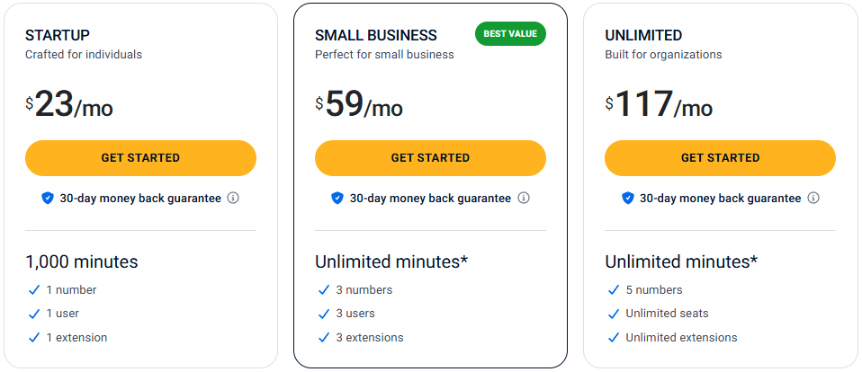
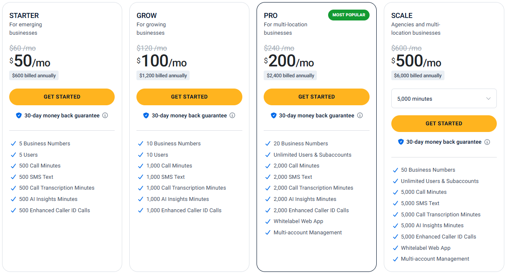

# 800.com Pricing Plans (2026) — Complete Guide

800.com has **two separate pricing systems** — Business Phone Plans and Call Tracking Plans. Most articles only cover one. This guide covers both with official data, no fluff, so you can pick the right plan fast. 💡

> ⚠️ Pricing may change. Always verify at www.800.com before purchasing.

## 1. 800.com Business Phone Plans Explained 📞

Business Phone Plans are for businesses that need a **professional toll-free, local, or vanity number** paired with a complete communication system — call forwarding, voicemail, business texting, VoIP calling, call analytics, and more.

There are **three plans**: Startup, Small Business, and Unlimited.

Annual billing saves **15%** vs monthly billing. All plans include a **30-day money-back guarantee** and **no setup fees**.

  

**Every Business Phone Plan includes these features — no upgrades needed:**

- ✅ Desktop & Mobile Apps
- ✅ VoIP / WiFi Calling
- ✅ Call Forwarding (Standard, Sequential, Simultaneous)
- ✅ Business Greeting
- ✅ Extensions
- ✅ Fax Number
- ✅ Call Recording
- ✅ Business Texting
- ✅ Call Analytics
- ✅ API and Webhook Access
- ✅ Voicemail Boxes
- ✅ Voicemail Transcription
- ✅ Call Screening

## 2. Startup / Small Business / Unlimited Breakdown 🔍

### 🚀 Startup Plan — Crafted for Individuals

| | |
|--|--|
| **Monthly Price** | $23/mo |
| **Annual Price** | $19/mo |
| **Numbers** | 1 |
| **Users** | 1 |
| **Extensions** | 1 |
| **Minutes** | 1,000/month |

The Startup plan is straightforward — one number, one user, one extension. The 1,000-minute cap is the key limitation. That works out to roughly 33 minutes of calls per day. Fine for a solopreneur. Not enough for a team.

**Who should buy this?** Freelancers, consultants, solo business owners who want a professional number without overpaying for unused seats.

  

### 🔥 Small Business Plan — Perfect for Small Business ⭐ Best Value

| | |
|--|--|
| **Monthly Price** | $59/mo |
| **Annual Price** | $49/mo |
| **Numbers** | 3 |
| **Users** | 3 |
| **Extensions** | 3 |
| **Minutes** | Unlimited* |

The jump from Startup to Small Business brings three meaningful upgrades: minutes go from capped to unlimited, numbers go from 1 to 3, and your team goes from 1 to 3 users. At $49/mo annual, this is the plan most small businesses should start with.

*Subject to 800.com's Fair Usage Policy.

**Who should buy this?** Small teams, local service businesses, law firms, clinics, agencies, e-commerce brands — any business with 2–3 people handling calls and more than one campaign running.

### 🏆 Unlimited Plan — Built for Organizations

| | |
|--|--|
| **Monthly Price** | $117/mo |
| **Annual Price** | $99/mo |
| **Numbers** | 5 |
| **Users** | Unlimited seats |
| **Extensions** | Unlimited |
| **Minutes** | Unlimited* |

The Unlimited plan is for organizations that have outgrown a 3-user limit. Unlimited seats and unlimited extensions mean you can scale your team without your phone system cost increasing. Five numbers give more dedicated campaign and department coverage.

*Subject to 800.com's Fair Usage Policy.

**Who should buy this?** Customer support centers, sales teams, multi-department businesses, franchises, and any organization with more than 3 active phone system users.

## 3. Business Phone Plans Comparison Table 📊

| Feature | **Startup** | **Small Business** ⭐ | **Unlimited** |
||:--:|:--:|:-:|
| Monthly Price | $23/mo | $59/mo | $117/mo |
| Annual Price | **$19/mo** | **$49/mo** | **$99/mo** |
| Business Numbers | 1 | 3 | 5 |
| Users | 1 | 3 | Unlimited |
| Extensions | 1 | 3 | Unlimited |
| Call Minutes | 1,000 min | Unlimited* | Unlimited* |
| Call Forwarding (3 types) | ✅ | ✅ | ✅ |
| Business Texting | ✅ | ✅ | ✅ |
| Voicemail + Transcription | ✅ | ✅ | ✅ |
| Call Recording | ✅ | ✅ | ✅ |
| Call Analytics | ✅ | ✅ | ✅ |
| Mobile & Desktop Apps | ✅ | ✅ | ✅ |
| VoIP / WiFi Calling | ✅ | ✅ | ✅ |
| Fax Number | ✅ | ✅ | ✅ |
| API & Webhook Access | ✅ | ✅ | ✅ |
| Call Screening | ✅ | ✅ | ✅ |
| 30-Day Money-Back | ✅ | ✅ | ✅ |
| Setup Fee | None | None | None |
| **Best For** | Solopreneurs | Small teams ⭐ | Organizations |

**Best value:** The **Small Business plan at $49/mo** (annual). Unlimited minutes, 3 numbers, 3 users, every feature included — most small businesses will never need to go beyond this.

## 4. Call Tracking Plans Explained 🎯

Call Tracking Plans are a completely separate product from Business Phone Plans. They're built for **marketers, agencies, and multi-location businesses** that need to measure which campaigns, ads, and channels are actually driving inbound phone calls.

The key difference:

- **Business Phone Plans** = your professional communication system
- **Call Tracking Plans** = your marketing measurement and analytics tool

If you're running Google Ads, Facebook Ads, radio, or billboards and have no idea which one is generating calls — Call Tracking Plans solve that problem.

  

Annual billing on Call Tracking Plans gives you **2 months free** (~17% savings). All plans include a **30-day money-back guarantee**.

**Every Call Tracking Plan includes on all tiers:**

- ✅ 800 Intelligence™
- ✅ Enhanced Caller ID
- ✅ Call Recording & Transcription
- ✅ Call Forwarding
- ✅ Extensions
- ✅ Desktop & Mobile Apps
- ✅ Dynamic Number Insertion (DNI)
- ✅ Voicemail Boxes & Transcription
- ✅ Ad Platform Integrations (Google Ads, Meta, etc.)
- ✅ CRM Integrations
- ✅ Workflow Integrations

### 💡 Starter — For Emerging Businesses

| | |
|--|--|
| **Annual Price** | $50/mo ($600/yr) |
| **Monthly Price** | $60/mo |
| **Business Numbers** | 5 |
| **Users** | 5 |
| **Call Minutes** | 500/mo |
| **SMS Text** | 500/mo |
| **Call Transcription Minutes** | 500/mo |
| **AI Insights Minutes** | 500/mo |
| **Enhanced Caller ID Calls** | 500/mo |
| **Whitelabel Web App** | ❌ |
| **Multi-account Management** | ❌ |

With 5 numbers you can assign one to each major channel — Google Ads, Facebook, billboard, website, radio — and see exactly which one drives calls. Best for small businesses just starting to measure call ROI. 📊

### 📈 Grow — For Growing Businesses

| | |
|--|--|
| **Annual Price** | $100/mo ($1,200/yr) |
| **Monthly Price** | $120/mo |
| **Business Numbers** | 10 |
| **Users** | 10 |
| **Call Minutes** | 1,000/mo |
| **SMS Text** | 1,000/mo |
| **Call Transcription Minutes** | 1,000/mo |
| **AI Insights Minutes** | 1,000/mo |
| **Enhanced Caller ID Calls** | 1,000/mo |
| **Whitelabel Web App** | ❌ |
| **Multi-account Management** | ❌ |

Ten numbers gives you enough flexibility to track multiple campaigns per channel, or separate numbers for each city you serve. Good for small agencies managing 2–3 clients.

### 🏆 Pro — For Multi-Location Businesses ⭐ Most Popular

| | |
|--|--|
| **Annual Price** | $200/mo ($2,400/yr) |
| **Monthly Price** | $240/mo |
| **Business Numbers** | 20 |
| **Users** | Unlimited + Subaccounts |
| **Call Minutes** | 2,000/mo |
| **SMS Text** | 2,000/mo |
| **Call Transcription Minutes** | 2,000/mo |
| **AI Insights Minutes** | 2,000/mo |
| **Enhanced Caller ID Calls** | 2,000/mo |
| **Whitelabel Web App** | ✅ |
| **Multi-account Management** | ✅ |

Pro unlocks two agency-critical features: **Whitelabel Web App** (present the dashboard to clients under your own branding) and **Multi-account Management** (manage all clients from one dashboard). For agencies, these features alone justify the plan. 🎯

### 🚀 Scale — For Agencies & Multi-Location Businesses

| | |
|--|--|
| **Annual Price** | $500/mo ($6,000/yr) — 5,000 min tier |
| **Monthly Price** | $600/mo |
| **Business Numbers** | 50 |
| **Users** | Unlimited + Subaccounts |
| **Call Minutes** | 5,000/mo (scalable to 100,000 min) |
| **SMS Text** | 5,000/mo |
| **Call Transcription Minutes** | 5,000/mo |
| **AI Insights Minutes** | 5,000/mo |
| **Enhanced Caller ID Calls** | 5,000/mo |
| **Whitelabel Web App** | ✅ |
| **Multi-account Management** | ✅ |

Scale is the enterprise tier. 50 numbers, unlimited users, and scalable minute pools (5,000 / 10,000 / 30,000 / 100,000 min options) make this right for large agencies, national franchises, and high-volume lead generation operations.

## 5. Call Tracking Plans Comparison Table 📊

| Feature            | Starter   | Grow          | Pro ⭐      | Scale      |
| ------------------ | --------- | ------------- | ---------- | ---------- |
| Annual Price       | $50/mo    | $100/mo       | $200/mo    | $500/mo+   |
| Monthly Price      | $60/mo    | $120/mo       | $240/mo    | $600/mo+   |
| Business Numbers   | 5         | 10            | 20         | 50         |
| Users              | 5         | 10            | Unlimited  | Unlimited  |
| Call Minutes       | 500       | 1,000         | 2,000      | 5,000+     |
| SMS Text           | 500       | 1,000         | 2,000      | 5,000      |
| Transcription Min  | 500       | 1,000         | 2,000      | 5,000      |
| AI Insights Min    | 500       | 1,000         | 2,000      | 5,000      |
| Enhanced Caller ID | 500       | 1,000         | 2,000      | 5,000      |
| Whitelabel App     | ❌         | ❌             | ✅          | ✅          |
| Multi-account Mgmt | ❌         | ❌             | ✅          | ✅          |
| Ad Integrations    | ✅         | ✅             | ✅          | ✅          |
| CRM Integrations   | ✅         | ✅             | ✅          | ✅          |
| 800 Intelligence™  | ✅         | ✅             | ✅          | ✅          |
| 30-Day Money-Back  | ✅         | ✅             | ✅          | ✅          |
| Best For           | Local Biz | Growing Teams | Agencies ⭐ | Enterprise |

**Best ROI:** The Pro plan at $200/mo for agencies. The whitelabel app and multi-account management let you resell call tracking as a service — turning a $200/mo cost into a billable agency deliverable worth many times that.

---

## 6. Business Phone Plans vs Call Tracking Plans — Which One Should You Choose? 🤔

| Business Type              | Best Choice                                  | Reason                                   |
| -------------------------- | -------------------------------------------- | ---------------------------------------- |
| Solopreneur                | Business Phone — Startup                     | One number, one user, full features      |
| Small Team (2–3 People)    | Business Phone — Small Business              | Unlimited minutes, 3 users, 3 numbers    |
| Growing Organization       | Business Phone — Unlimited                   | Unlimited seats + extensions             |
| Local Business Running Ads | Phone + Tracking Starter                     | Communication + campaign measurement     |
| Marketing Agency           | Call Tracking — Pro or Scale                 | Whitelabel + multi-account management    |
| Multi-location Brand       | Call Tracking — Pro or Scale                 | Separate tracking per location           |
| Customer Support Team      | Business Phone — Small Business or Unlimited | Routing, extensions, voicemail           |
| Lead Generation Business   | Call Tracking — Grow or Pro                  | Prove ROI on every campaign              |
| Sales Team                 | Phone + Tracking                             | Communication AND marketing intelligence |
| Budget User                | Business Phone — Startup                     | Lowest cost, all features, one number    |

## 7. Toll-Free Number Pricing Explained ☎️

Understanding what affects the cost of your number helps you budget accurately.

### Standard Toll-Free Numbers
Included in your Business Phone Plan. No activation fee. Random toll-free numbers across 800, 888, 877, 866, 855, 844, and 833 prefixes activate within 1–2 hours. These are the most affordable and most available option. 📞

### Vanity Numbers
Numbers that spell a word or phrase (e.g., 1-800-PLUMBER). Pricing depends on the keyword's demand. Common industry terms cost more. Less common phrases cost closer to a standard toll-free number. Available through 800.com's search tool and the dedicated **Vanity Marketplace**.

### Premium Vanity Numbers
Curated high-value numbers from the Vanity Marketplace — specifically selected for advertising effectiveness. Higher upfront cost, but for businesses running radio, TV, or billboard ads, the ROI from improved brand recall typically covers the cost quickly. ✨

### Number Porting
Bring your existing business number to 800.com. No setup fee. Average transfer time: approximately 2 weeks. Best choice if your customers already know your current number — you keep your brand equity and gain 800.com's feature set.

**What drives toll-free number pricing:**
- Prefix demand (800 is more sought-after than 833)
- Standard vs vanity vs premium type
- Keyword popularity for vanity numbers
- Current marketplace availability

> Check the official 800.com website for current add-on number pricing, as rates vary by number type and availability.

## 8. Monthly vs Annual Billing — How Much Can You Save? 💵

### Business Phone Plans (Save 15% Annual)

| Plan           | Monthly | Annual | You Save  |
| -------------- | ------- | ------ | --------- |
| Startup        | $23/mo  | $19/mo | $48/year  |
| Small Business | $59/mo  | $49/mo | $120/year |
| Unlimited      | $117/mo | $99/mo | $216/year |

### Call Tracking Plans (2 Months Free Annual)

| Plan    | Monthly | Annual  | You Save    |
| ------- | ------- | ------- | ----------- |
| Starter | $60/mo  | $50/mo  | $120/year   |
| Grow    | $120/mo | $100/mo | $240/year   |
| Pro     | $240/mo | $200/mo | $480/year   |
| Scale   | $600/mo | $500/mo | $1,200/year |

Annual billing is almost always worth it if you've confirmed the platform works for your business. The 30-day money-back guarantee lets you test first, then switch to annual once you're confident.

Monthly billing makes sense if you're still evaluating, or if your business has highly seasonal call volume and you may not need the plan year-round.

## 9. 800.com vs Competitors Pricing Comparison ⚖️

| Provider | Starting Price | Toll-Free | Vanity Numbers | Call Tracking | Best For |
|-||--|-||-|
| **800.com** | $19/mo (annual) | ✅ All prefixes | ✅ Marketplace | ✅ Dedicated plans | SMBs, agencies |
| **Grasshopper** | $14/mo (annual) | ✅ Limited | ✅ Limited | ❌ None | Solopreneurs |
| **Nextiva** | $15/user/mo (annual) | ✅ Engage plan only | ✅ Limited | ❌ None | VoIP-first teams |
| **RingCentral** | $20/user/mo (annual) | ✅ 1 included, 100 min cap | ✅ $30 add-on fee | ❌ None | Enterprise UCaaS |
| **Google Voice** | $10/user/mo + Workspace | ❌ Not available | ❌ Not available | ❌ None | Google Workspace users |

**Where 800.com wins:**

- 🏆 **Toll-free & vanity focus** — Only provider built specifically around business phone numbers. All prefixes, Vanity Marketplace, no activation fees on standard numbers.
- 🏆 **All-inclusive plans** — Every feature included from the base plan. RingCentral charges $30 to add a vanity number. Nextiva only includes toll-free on the $24/user/mo Engage plan. 800.com includes everything from $19/mo.
- 🏆 **Call tracking** — The only provider in this comparison with dedicated call tracking plans. Grasshopper, Nextiva, RingCentral, and Google Voice all lack this.
- 🏆 **Flat pricing on phone plans** — No per-user cost on Business Phone Plans means 3 users on the Small Business plan costs $49/mo total. RingCentral at $20/user/mo costs $60/mo for just 3 users — and with fewer features at that tier.

**Where competitors may win:**

- Grasshopper at $14/mo is cheaper if you only need one number and the absolute basics
- Nextiva and RingCentral have stronger video conferencing and team messaging features for enterprises
- Google Voice is cheaper for existing Google Workspace users who don't need toll-free

## 10. Which 800.com Plan Offers the Best Value? 🏅

| Use Case | Best Plan | Price (Annual) |
|-|--|-|
| Solo business owner | Business Phone — Startup | $19/mo |
| Small team (2–3 people) | Business Phone — Small Business ⭐ | $49/mo |
| Growing organization | Business Phone — Unlimited | $99/mo |
| Local biz tracking ads | Call Tracking — Starter | $50/mo |
| Growing ad campaigns | Call Tracking — Grow | $100/mo |
| Marketing agency | Call Tracking — Pro ⭐ | $200/mo |
| Large agency / enterprise | Call Tracking — Scale | $500/mo+ |

**Top picks:**

- **Best overall value:** Small Business plan at $49/mo (annual) — unlimited minutes, 3 numbers, 3 users, all features. Most small businesses never need to upgrade beyond this. ⭐
- **Best budget entry:** Startup plan at $19/mo (annual) — full features, one professional number, no fluff.
- **Best for agencies:** Call Tracking Pro at $200/mo (annual) — whitelabel branding + multi-account management make this a resellable service.
- **Best combined setup:** Small Business ($49/mo) + Call Tracking Starter ($50/mo) = $99/mo total for a business running ads and needing both communication and measurement.

## 12. Final Verdict — Is 800.com Worth the Price? ✅

**Short answer: Yes — if your business depends on phone calls.**

If you're a solopreneur who needs one professional number, the **Startup plan at $19/mo** is a no-brainer. No setup fees, full features, 30-day money-back guarantee — there's very little risk.

If you have a small team, the **Small Business plan at $49/mo** gives you unlimited minutes, 3 numbers, 3 users, and every feature the platform offers. That's where most small businesses should start and stay.

If you're a marketing agency or multi-location business running ad campaigns, the **Call Tracking Pro plan at $200/mo** pays for itself the moment you can show clients exactly which campaigns are generating phone leads. The whitelabel app alone is worth the upgrade from lower tiers.

The thing that sets 800.com apart from competitors isn't just the pricing — it's the combination of **toll-free number expertise, all-inclusive plan features, and dedicated call tracking infrastructure** that no direct competitor in this price range matches.

> 💡 If your business depends on phone calls, lead generation, customer support, or call tracking — 800.com offers one of the most complete toll-free communication platforms available today.

**Compare the plans, check your number availability, and choose the setup that fits your call volume, team size, and marketing needs.**

## 11. FAQs — 800.com Pricing Plans ❓

**How much does 800.com cost?**
- Business Phone Plans start at $19/mo (annual) or $23/mo (monthly). Call Tracking Plans start at $50/mo (annual) or $60/mo (monthly).

**Does 800.com offer annual discounts?**
- Yes. Business Phone Plans save 15% on annual billing. Call Tracking Plans give 2 months free on annual billing (~17% savings).

**Are vanity numbers included in plan pricing?**
- Standard toll-free and local numbers have no extra activation fee. Vanity and premium numbers from the Vanity Marketplace carry additional costs depending on demand and keyword availability.

**Can I port my existing number?**
- Yes. No setup fee. Average porting time is approximately 2 weeks. Works for both toll-free and local numbers.

**Which plan is best for small businesses?**
- The Small Business plan at $49/mo (annual) — 3 numbers, 3 users, unlimited minutes, all features included. It's labeled "Best Value" on the official pricing page for good reason.

**Is call tracking included in Business Phone Plans?**
- Basic call analytics are included. The dedicated Call Tracking Plans add Dynamic Number Insertion, AI Insights, Call Transcription, ad platform integrations, CRM integrations, whitelabel reporting, and multi-account management.

**Is 800.com cheaper than RingCentral?**
- On a per-feature basis, yes. 800.com's Small Business plan covers 3 users at $49/mo total. RingCentral's Core plan is $20/user/mo — $60/mo for 3 users — with only 100 toll-free minutes included, vanity numbers as a paid add-on, and AI tools as separate purchases.

- **Does 800.com charge setup fees?**
No setup fees on standard toll-free or local numbers. Vanity and premium numbers may have separate pricing — check the official site.

**Is there a free trial?**
- No free trial, but all plans include a **30-day money-back guarantee**. Test the full platform risk-free for a month.

**Which plan offers the best value overall?**
- Business Phone — Small Business at $49/mo for most small businesses. Call Tracking — Pro at $200/mo for agencies managing multiple clients.

*Last updated: June 2026 | All pricing sourced from official 800.com pricing pages. Rates subject to change — verify at www.800.com
