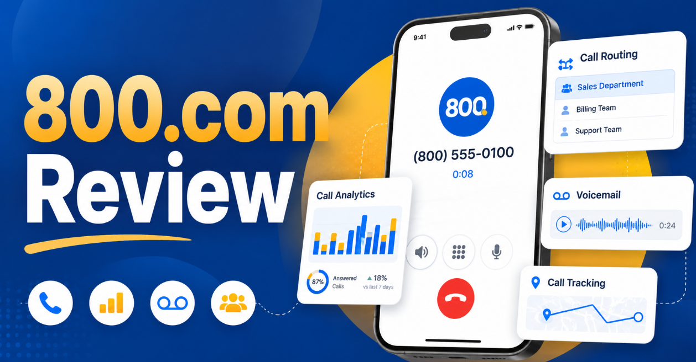
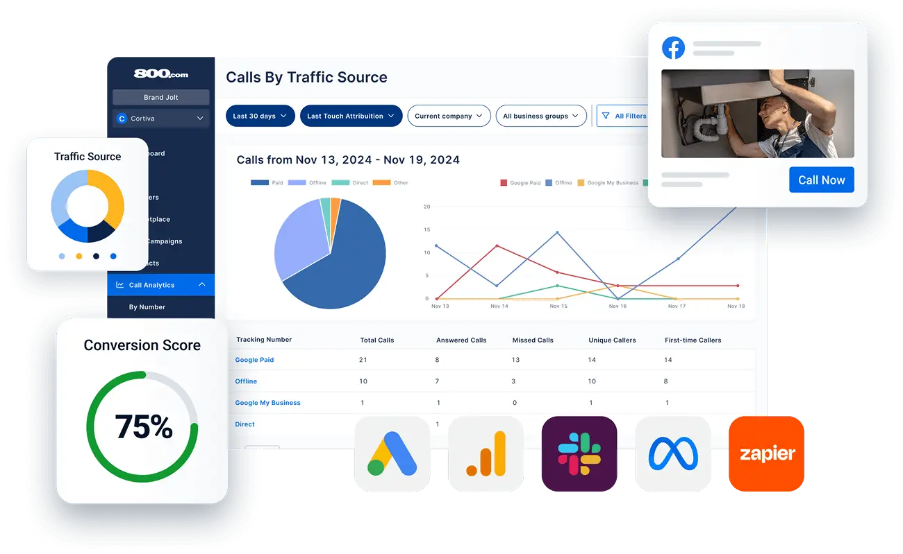
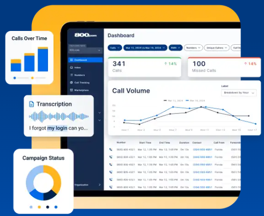
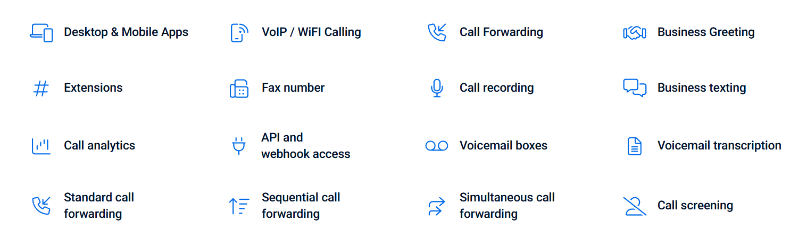
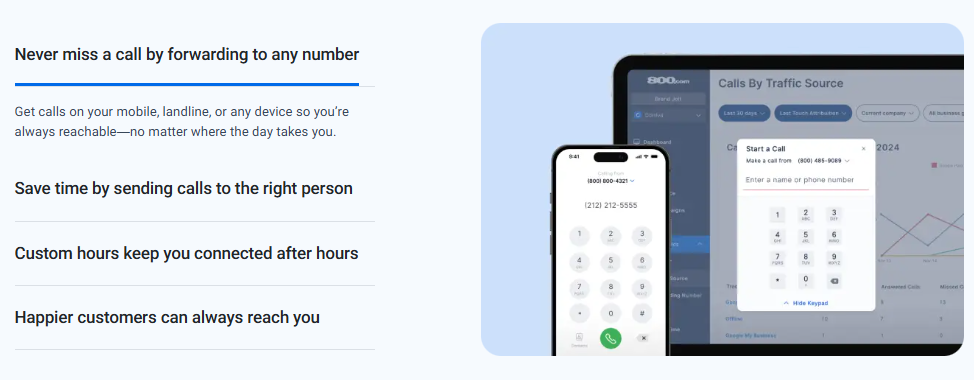
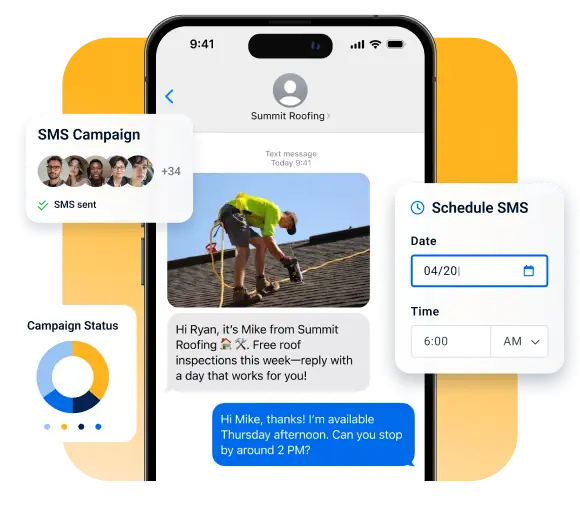
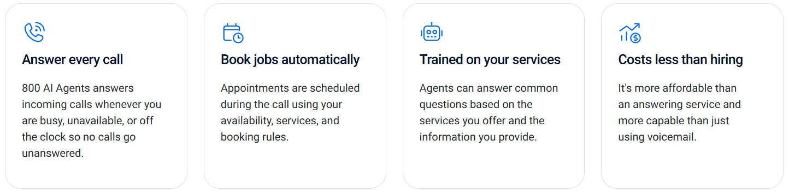
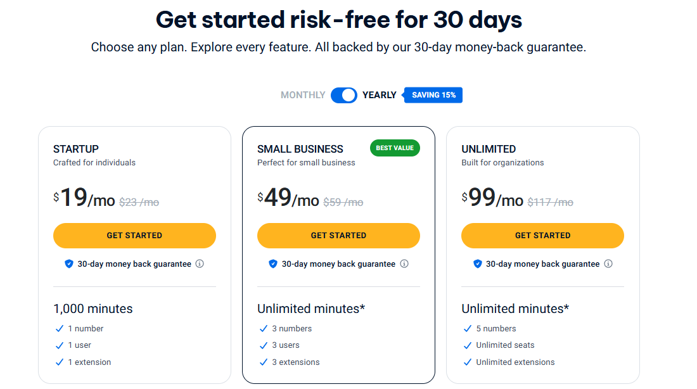

# 800.com Review: Best Toll-Free Number Service in 2026?

  

You pick up the phone. A potential customer is calling. But wait are they even calling you in the first place?

Here's the uncomfortable truth: if your business doesn't have a professional phone number, customers are already choosing your competitor over you. A random cell number doesn't just look unprofessional — it actively drives people away before you even get a chance to speak.

That's exactly why thousands of businesses in 2026 are turning to 800.com a platform built to give you toll-free numbers, vanity numbers, local numbers, call forwarding, SMS marketing, call analytics, and even AI-powered tools, all under one roof.

So here's your moment. 💡
Stop letting your phone number work against you. This isn't just another review this is your practical, no-fluff buying guide to understanding whether 800.com is the right move for your business right now.

We're breaking down everything: the number types, the pricing, the features, the real pros and cons, and how it stacks up against the competition.
Ready to finally give your business the phone presence it deserves? Let's go.

## 📌1. What Is 800.com? — Quick Overview

800.com is a US-based business phone number and cloud communication platform that has been helping businesses get professional phone numbers and manage calls for years.

At its core, 800.com lets businesses:

- **Search and buy** toll-free numbers (800, 888, 877, 866, 855, 844, 833 prefixes)
- **Get vanity numbers** that spell out a memorable word or phrase
- **Buy local numbers** to build a local presence in specific cities
- **Access premium numbers** that stand out in advertising
- **Get Canadian numbers** for businesses operating in Canada
- **Port existing numbers** so you don't lose your current business number

Beyond the number itself, 800.com is a full-featured virtual phone system. Once you have your number, you can route calls, send business texts, track call analytics, set up voicemail, record calls, use extensions, and even deploy AI agents to handle customer interactions automatically.

**Who is 800.com built for?**

- Small businesses that want a professional phone presence
- Sales teams tracking leads from different ad campaigns
- Customer support teams that need call routing and voicemail management
- Service businesses like law firms, clinics, contractors, and agencies
- E-commerce brands that want to add phone support
- Lead generation businesses that need call tracking and analytics

  

## 📌2. How 800.com Works for Business Phone Numbers

Getting started with 800.com is straightforward even if you've never set up a business phone system before.

**Here's how the basic workflow looks:**

1. **Choose your number type** — Decide whether you want toll-free, local, vanity, premium, or Canadian.
2. **Search available numbers** — Use 800.com's search tool to find your preferred number or keyword.
3. **Pick a plan** — Choose from Startup, Small Business, or Unlimited based on your call volume and team size.
4. **Set up your system** — Configure call forwarding, voicemail, greetings, extensions, and SMS.
5. **Start using the number** — Add it to your ads, website, business cards, Google listing, and customer support channels.

There's no complicated hardware to install. Everything runs in the cloud, and 800.com has both desktop and mobile apps so your team can make and receive calls from anywhere.

## 📌 3. 800.com Number Types — Toll-Free, Local, Vanity, Premium & Canadian Numbers

One of the biggest reasons businesses choose 800.com is the variety of phone number types available. Here's a breakdown:

| Number Type | Best For | Example | Branding Value | Availability Note |
|-------------|----------|---------|----------------|-------------------|
| **Toll-Free Numbers** | National reach, customer support | 1-800-555-0100 | ⭐⭐⭐⭐⭐ | High availability across all prefixes |
| **Local Numbers** | Local businesses, regional trust | (212) 555-0150 | ⭐⭐⭐⭐ | Based on area code availability |
| **Vanity Numbers** | Brand recall, advertising, lead gen | 1-800-FLOWERS style | ⭐⭐⭐⭐⭐ | Availability varies by keyword |
| **Premium Numbers** | High-value advertising, memorable sequences | 1-800-800-1234 | ⭐⭐⭐⭐⭐ | Limited, higher cost |
| **Canadian Numbers** | Canada operations, cross-border businesses | 1-888-555-0199 | ⭐⭐⭐⭐ | Available for Canada market |
| **Port Your Number** | Businesses keeping their existing number | Your current number | ⭐⭐⭐⭐⭐ | ~2 weeks average porting time |

## 📌4. 800.com Toll-Free Number Review 📱

Toll-free numbers are the backbone of 800.com's offering and they're one of the most powerful branding tools for any business.

### What Is a Toll-Free Number?

A toll-free number is a phone number where the business (not the caller) pays for the call. Customers can call you for free, which removes friction and encourages more inbound calls.

800.com offers toll-free numbers across all major prefixes:

- **800** — the most recognizable and trusted prefix
- **888, 877, 866, 855, 844, 833** — equally valid and widely used alternatives

### Why Toll-Free Numbers Build Business Credibility

When a customer sees a 1-800 number, they immediately associate it with a legitimate, established business. It signals that you're not just a one-person operation, and that you're invested in professional customer communication.

Toll-free numbers are especially powerful for:

- **National businesses** that serve customers across states
- **Customer support teams** that want to encourage inbound calls
- **E-commerce brands** that want to offer phone-based support
- **Service businesses** like law firms, financial advisors, and insurance agencies
- **Advertising campaigns** on TV, radio, print, or digital channels

With 800.com, toll-free numbers can be set up quickly random toll-free numbers are typically activated within 1-2 hours according to official 800.com information.

  

## 📌5. 800.com Vanity Phone Number Review ✨

If you want customers to *remember* your number long after they hear it, a vanity number is the way to go.

### What Is a Vanity Number?

A vanity number is a <a href="https://www.iplum.com/blog/understanding-the-benefits-of-a-business-800-phone-number-for-growth" rel="nofollow noopener">toll-free</a> or local number where the digits spell out a word, phrase, or acronym on a phone keypad. Think 1-800-FLOWERS or 1-800-LAWYERS.

These numbers are incredibly powerful because they are:

- **Easy to remember** — customers hear them once and recall them days later
- **Great for advertising** — perfect for billboards, radio, TV, and digital ads
- **Brand-building tools** — they communicate what you do the moment someone hears the number

### 800.com Vanity Marketplace

800.com has a dedicated Vanity Marketplace for premium vanity numbers — numbers specifically curated for high-spend advertising and inbound lead generation campaigns.

If you need a number that directly supports a marketing campaign, the Vanity Marketplace is where you'll find the best options.

According to official 800.com information, vanity numbers can take 1–5 days to activate, and businesses can also contact 800.com's customer service team to request specific numbers or vanity spellings.

### Best Use Cases for Vanity Numbers

- **Home services**: 1-800-PLUMBER, 1-800-ROOFER
- **Legal services**: 1-800-LAWYERS, 1-800-JUSTICE
- **Healthcare**: 1-800-DENTIST, 1-800-DOCTOR
- **Real estate**: Your city + keyword combination
- **Retail and e-commerce**: Brand-name vanity numbers for advertising
- **Lead generation agencies**: Campaign-specific tracking numbers

## 📌6. 800.com Local Number Review 🏙️

Not every business needs a national presence. Sometimes, you want customers to feel like you're their neighborhood provider and that's exactly what local numbers help you achieve.

### Why Local Numbers Build Local Trust

When a customer in Chicago sees a 312 number calling them, they're far more likely to pick up than if they see an unknown toll-free number. Local numbers signal familiarity and proximity.

800.com offers local numbers tied to specific area codes, giving businesses the ability to:

- **Appear local** in specific cities or regions, even if they operate remotely
- **Build trust** with local customers who prefer dealing with local businesses
- **Run location-specific ad campaigns** with trackable local numbers

### Who Benefits Most from Local Numbers?

- **Local service providers** — plumbers, electricians, HVAC technicians
- **Healthcare clinics** — doctors, dentists, therapy practices
- **Real estate agents** — local market credibility
- **Consultants and agencies** — appearing local to their target client base
- **Contractors and home improvement businesses**

### Local Numbers vs Toll-Free Numbers

| Feature            | Local Number                  | Toll-Free Number               |
|--|-|--|
| Geographic trust   | ✅ Strong local signal         | ❌ National, less local feel    |
| Customer cost      | Standard local rates          | Free for caller                |
| Best for           | Local businesses, agencies    | National brands, support teams |
| Brand recall       | Moderate                      | High (especially vanity)       |
| Advertising reach  | City/region level             | National campaigns             |

## 📌7. 800.com Number Porting — How to Transfer Your Existing Number 🔄

If you already have a business phone number that your customers know and trust, you don't have to abandon it to use 800.com. Number porting lets you bring your existing number with you.

### What Is Number Porting?

Number porting is the process of transferring your existing phone number from your current provider to a new provider in this case, 800.com.

### Why Businesses Port Numbers Instead of Buying New Ones

- You've already spent time and money building brand recognition around your current number
- Customers, partners, and vendors already have your number saved
- Changing numbers means updating all your marketing materials, listings, and ads

### How 800.com's Port-My-Number Option Works

According to official 800.com information, here's the process:

1. **Sign up** for an 800.com account
2. After login, go to the **Numbers section** in your Dashboard
3. Follow the instructions in the **"Port Number"** option (top right blue box)

The average porting time is approximately **2 weeks**.

### What to Check Before Porting Your Number

- **Confirm your current provider** supports outbound porting
- **Verify number ownership** — the number must be in your name or company name
- **Have your account information ready** — your current provider's account number and PIN
- **Plan for routing** — set up your call forwarding and system on 800.com before the port completes
- **Downtime risk is minimal** but have a backup plan during the transition window

## 📌8. 800.com Features — Call Forwarding, AI Tools, SMS, Analytics, Apps & More 🛠️

One of the strongest parts of 800.com is how many business communication features come included with every plan. Let's break them all down.

  

### 📱 Desktop & Mobile Apps

**What it does:** 800.com has apps for both desktop and mobile, so you and your team can make and receive calls from anywhere.

**Why it matters:** You're not tied to a desk phone. Whether you're in the office, at home, or traveling, your business number travels with you.

**Best for:** Remote teams, small businesses, sales reps on the go.

### 📶 VoIP / WiFi Calling

**What it does:** Make and receive calls over your internet connection — no traditional phone line needed.

**Why it matters:** Eliminates the need for expensive landlines. Works anywhere with a stable internet connection.

**Best for:** Remote businesses, home offices, multi-location teams.

### 📲 Call Forwarding (Standard, Sequential & Simultaneous)

  

800.com includes three types of call forwarding — making it more flexible than many basic virtual phone systems.

- **Standard Call Forwarding**: Route all incoming calls to a specific number or device.
- **Sequential Call Forwarding**: Ring multiple numbers in a sequence — if the first doesn't answer, try the next, and so on.
- **Simultaneous Call Forwarding**: Ring all your numbers at the same time — first person to answer gets the call.

**Why it matters:** You never miss an important call. Whether you have a team of agents or just yourself, you can route calls intelligently.

**Best for:** Sales teams, customer support, service businesses with multiple staff.

### 🎙️ Business Greeting

**What it does:** Set up a custom greeting that plays when customers call your number.

**Why it matters:** A professional greeting instantly elevates your brand's credibility. "Thank you for calling [Business Name]..." is far better than a plain ringing phone.

**Best for:** Every business — this is a fundamental professionalism feature.

### 🔢 Extensions

**What it does:** Set up department or individual extensions so callers can reach the right person or team.

**Why it matters:** Organizes your call routing professionally. Customers can press 1 for sales, 2 for support, etc.

**Best for:** Small businesses with multiple departments or staff members.

### 📠 Fax Number

**What it does:** Receive faxes through your 800.com account without a physical fax machine.

**Why it matters:** Some industries — legal, healthcare, real estate — still rely on fax communication. 800.com handles this digitally.

**Best for:** Law firms, medical offices, real estate agencies.

### 🎙️ Call Recording

**What it does:** Automatically or manually record incoming and outgoing calls.

**Why it matters:** Recordings are invaluable for quality assurance, training, dispute resolution, and compliance.

**Best for:** Sales teams, customer support centers, legal and financial services.

### 💬 Business Texting & SMS Marketing

**What it does:** Send and receive text messages from your business number. Run SMS marketing campaigns to engage customers with personalized texts.

**Why it matters:** Texting has one of the highest open rates of any communication channel. Being able to text from your professional business number keeps communication consolidated and professional.

**Best for:** E-commerce brands, appointment-based businesses, local service providers, lead generation campaigns.

  

### 📊 Call Analytics & Call Tracking

**What it does:** Track every call — volume, duration, source, time of day, and more. Understand which marketing channels are driving phone leads.

**Why it matters:** If you're running ads on Google, Facebook, or print, call tracking tells you exactly which campaigns are generating calls. This data is gold for ROI optimization.

**Best for:** Marketing-driven businesses, agencies, lead generation companies, sales teams.

### 🔗 API and Webhook Access

**What it does:** Integrate 800.com with your CRM, marketing tools, or custom software using the API and webhooks.

**Why it matters:** Advanced users can automate workflows — like logging calls to a CRM, triggering follow-up sequences, or connecting to Zapier-style automations.

**Best for:** Tech-savvy businesses, marketing agencies, sales operations teams.

### 📬 Voicemail Boxes & Voicemail Transcription

**What it does:** Dedicated voicemail boxes for your numbers or extensions, with automatic transcription so you can read messages instead of listening to them.

**Why it matters:** Voicemail transcription saves time and ensures no message gets missed, even in a noisy environment.

**Best for:** Busy professionals, small business owners, support teams.

### 🛑 Call Screening

**What it does:** Screen calls before answering — hear who is calling and decide whether to accept or send to voicemail.

**Why it matters:** Helps filter spam and unwanted calls, and lets you prepare before speaking to a customer.

**Best for:** Solo entrepreneurs, consultants, service businesses.

### 🤖 AI Agents (AI Feature)

**What it does:** Automate customer interactions with AI-powered virtual assistants that can handle calls, answer questions, and gather information.

**Why it matters:** AI Agents mean you never miss a call — even after hours. They can handle common queries, qualify leads, and route complex requests to a human.

**Best for:** Businesses with high call volume, after-hours support needs, lead qualification.

  

### 🧠 800 Intelligence™ (AI Feature)

**What it does:** Turn every call into summaries, scores, and AI-recommended follow-ups.

**Why it matters:** Instead of manually reviewing call recordings, 800 Intelligence™ automatically summarizes what happened, scores the interaction, and tells you what to do next. This is a serious productivity multiplier for sales and support teams.

**Best for:** Sales teams, customer success managers, businesses focused on call quality improvement.

### 📋 Enhanced Caller ID

**What it does:** See detailed information about who is calling your business phone — before you pick up.

**Why it matters:** Knowing who is calling lets your team prepare and personalize the conversation, improving customer experience.

**Best for:** Sales teams, service businesses, support centers.

## 📌 9. 800.com Pricing & Plans Explained 💰

800.com offers three plans, with both monthly and annual billing options. Annual billing saves you 15% compared to monthly billing.

> ⚠️ **Note:** Pricing may change. Always check the official 800.com pricing page for the most current rates.

### Pricing Table

  

| Plan | Monthly Price | Annual Price | Numbers | Minutes | Users | Extensions | Best For |
|------|---------------|--------------|---------|---------|-------|------------|----------|
| **Startup** | $23/mo | $19/mo | 1 number | 1,000 minutes | 1 user | 1 extension | Individuals, solopreneurs |
| **Small Business** ⭐ Best Value | $59/mo | $49/mo | 3 numbers | Unlimited* | 3 users | 3 extensions | Small teams, growing businesses |
| **Unlimited** | $117/mo | $99/mo | 5 numbers | Unlimited* | Unlimited seats | Unlimited extensions | Organizations, larger support teams |

*Unlimited minutes are subject to 800.com's Fair Usage Policy.

---

### What's Included in Every Plan?

Every single 800.com plan — including the entry-level Startup plan — includes all of these features:

- ✅ Desktop & Mobile Apps
- ✅ VoIP / WiFi Calling
- ✅ Call Forwarding (Standard, Sequential, Simultaneous)
- ✅ Business Greeting
- ✅ Extensions
- ✅ Fax Number
- ✅ Call Recording
- ✅ Business Texting
- ✅ Call Analytics
- ✅ API and Webhook Access
- ✅ Voicemail Boxes
- ✅ Voicemail Transcription
- ✅ Call Screening

**No activation fees** for local or toll-free numbers. No long-term contracts required. All plans come with a **30-day money-back guarantee**.

Additional numbers can be added to your account at any time through your dashboard.

## 📌 10. 800.com Pros & Cons

| ✅ Pros | ❌ Cons |
|---------|---------|
| Strong toll-free number options across all major prefixes | Premium and vanity numbers may cost more than standard numbers |
| Vanity numbers available via search and dedicated Vanity Marketplace | Startup plan limited to 1,000 minutes — not ideal for high-volume callers |
| Local numbers for building regional trust | Some advanced AI features (Agents, 800 Intelligence™) may be add-ons |
| Number porting available — keep your existing number | Vanity number activation can take up to 5 days |
| SMS marketing and business texting included | Not ideal if you only need free or very basic phone calling |
| Three call forwarding types (standard, sequential, simultaneous) | Users needing full UCaaS suites may prefer RingCentral or Nextiva |
| Call analytics and call tracking for ROI measurement | Should check minute and SMS limits before committing to a plan |
| Desktop and mobile apps for remote and flexible teams | Customer service limited to Mon–Fri, 9am–6pm Eastern Time |
| AI Agents and 800 Intelligence™ for automation and call insights | |
| No setup fees, no long-term contracts, 30-day money-back guarantee | |
| G2-recognized for Easiest to Use and Easiest Setup (Mid-Market & SMB) | |

  

## 📌 11. 800.com vs Competitors — Grasshopper, RingCentral, Nextiva & OpenPhone ⚔️

How does 800.com stack up against the competition? Here's an honest comparison.

| Platform | Best For | Toll-Free | Vanity Numbers | Local Numbers | SMS | Call Analytics | Apps | Starting Price | Ideal User |
|----------|----------|-----------|----------------|---------------|-----|----------------|------|----------------|------------|
| **800.com** | Number-first business phone systems | ✅ Yes | ✅ Yes (Marketplace) | ✅ Yes | ✅ Yes | ✅ Advanced | ✅ Yes | $19/mo (annual) | Small–medium businesses |
| **Grasshopper** | Simple virtual phone for solos | ✅ Yes | ✅ Limited | ✅ Yes | ✅ Basic | ❌ Limited | ✅ Yes | ~$14/mo | Solopreneurs, freelancers |
| **RingCentral** | Full unified communications | ✅ Yes | ✅ Yes | ✅ Yes | ✅ Yes | ✅ Advanced | ✅ Yes | ~$20/mo | Mid-size to enterprise teams |
| **Nextiva** | VoIP + customer communication | ✅ Yes | ✅ Limited | ✅ Yes | ✅ Yes | ✅ Yes | ✅ Yes | ~$18/mo | Customer-facing business teams |
| **OpenPhone** | Modern small teams | ✅ Yes | ❌ Limited | ✅ Yes | ✅ Yes | ✅ Basic | ✅ Yes | ~$15/mo | Startups, tech-forward SMBs |
| **Phone.com** | Flexible business phone plans | ✅ Yes | ✅ Yes | ✅ Yes | ✅ Yes | ✅ Yes | ✅ Yes | ~$14/mo | Budget-conscious small businesses |

### Where 800.com Wins

- **Vanity number selection** — 800.com's dedicated Vanity Marketplace is more extensive than most competitors
- **Toll-free number focus** — deeper expertise in toll-free numbers than general VoIP platforms
- **AI features** — 800 Intelligence™ and AI Agents are differentiators in the SMB phone space
- **All-inclusive plans** — all features included from the base plan upward, no hidden upgrades

### Where Competitors May Be Better

- **RingCentral** wins for teams that need deep unified communications, video conferencing, and enterprise integrations
- **Nextiva** may be better for businesses that want strong CRM integrations out of the box
- **OpenPhone** is a great modern alternative for tech-first startups that want a simple, app-based experience
- **Grasshopper** is simpler and cheaper for very basic virtual number needs

## 📌12. Who Should Use 800.com? — Best Use Cases 🎯

### ✅ Best Fit For:

- **Small businesses** that want a professional phone presence without enterprise complexity
- **Sales teams** that need call tracking, analytics, and lead attribution
- **Customer support teams** that handle inbound call volume and need routing, recording, and voicemail
- **Law firms** — toll-free numbers, call recording, and call screening are particularly valuable
- **Healthcare clinics** — local or toll-free numbers with voicemail transcription and fax support
- **Home service providers** — plumbers, electricians, HVAC companies running local or vanity number campaigns
- **Marketing agencies** — call tracking for client campaign attribution
- **E-commerce brands** — adding phone support to their customer service mix
- **Lead generation businesses** — tracking which sources drive inbound calls

### ❌ Not the Best Fit For:

- Businesses with zero inbound call volume that rely solely on chat or email
- Users looking for completely free phone calling with no monthly cost
- Large enterprises that need deep unified communications with video, team messaging, and advanced CRM — they may be better served by RingCentral or Nextiva
- Teams that rely entirely on live chat platforms and have no phone-based customer interaction

## 📌13. 800.com Customer Reviews & User Feedback 🌟

800.com has earned recognition across multiple review platforms:

- **G2**: Recognized for *Easiest to Use* (Mid-Market), *Easiest Setup* (Small Business), *Leader* status, *Easiest to Do Business With* (Small Business), and *Best Relationship* (Mid-Market)
- **Capterra**: Listed and reviewed positively by business users
- **Trustpilot**: Rated by real customers
- **Best Reviews**: Awarded a 5-star rating badge

### What Users Commonly Praise:

- **Quick number setup** — toll-free and local numbers are often active within hours
- **Vanity number availability** — the Vanity Marketplace gives businesses real options
- **Call forwarding flexibility** — the three types of forwarding (standard, sequential, simultaneous) are widely appreciated
- **SMS and analytics** — business texting and call analytics are cited as practical, useful features
- **Professional business image** — users consistently mention that having an 800 or vanity number elevated how customers perceived their business

### What Users Mention as Considerations:

- **Pricing for premium/vanity numbers** — specialty numbers come at a higher cost, which is expected but worth factoring in
- **Startup plan minute limits** — the 1,000-minute cap on the entry plan may not suit businesses with moderate-to-high call volume
- **Vanity number timing** — the 1–5 day activation window for vanity numbers requires planning ahead of campaign launches
- **Support hours** — customer service is available Monday–Friday, 9am–6pm Eastern Time only

Overall, the feedback pattern is consistent: 800.com delivers on its promise of professional business numbers with solid communication features, and the platform earns high marks for ease of use and setup.

## 📌14. 800.com Alternatives — Best Tools to Compare 🔄

If you want to compare 800.com against other options before deciding, here's a quick guide:

| **Platform**    | **Best For**                        | **Starting Price** | **Standout Feature**                    |
|--|-|--|--|
| **Grasshopper** | Simple virtual numbers for solos    | ~$14/mo            | Easy setup, no frills                   |
| **RingCentral** | Full business communications        | ~$20/mo            | Video, team messaging, enterprise grade |
| **Nextiva**     | VoIP + customer communication       | ~$18/mo            | Strong CRM integrations                 |
| **OpenPhone**   | Modern small teams                  | ~$15/mo            | Clean app-first experience              |
| **Phone.com**   | Flexible business phone plans       | ~$14/mo            | Pay-per-minute option available         |

- **Grasshopper** is good if you want a simple virtual phone number with basic call forwarding and nothing complex.
- **RingCentral** is the go-to for companies that need full unified communications beyond just phone numbers.
- **Nextiva** shines for businesses that want VoIP deeply integrated with customer journey tools.
- **OpenPhone** is popular with startups and small teams that want a modern, app-first communication experience.
- **Phone.com** is a solid alternative for budget-focused businesses that want flexible business phone plans.

**800.com's edge**: Where it stands apart is the combination of toll-free expertise, vanity number marketplace, call analytics, and AI-powered features — all within a clean, easy-to-use platform.

## 📌15. Final Verdict — Is 800.com Worth It in 2026? 🏁

After reviewing 800.com's full feature set, pricing, number types, and user feedback, here's the honest bottom line:

**800.com is a strong, well-rounded business phone number platform that genuinely delivers on its core promise** — giving businesses professional phone numbers backed by useful communication tools.

Here's what stands out in 2026:

- **Number variety is exceptional** — toll-free, local, vanity, premium, Canadian, and porting all in one platform
- **All features included from day one** — no nickel-and-diming for basic functionality
- **AI features are ahead of the curve** — AI Agents and 800 Intelligence™ bring automation and call intelligence that many SMB phone platforms don't offer yet
- **Pricing is competitive** — at $19/mo for individuals and $49/mo for small teams (annual), the value is solid
- **No contracts, no activation fees, 30-day money-back guarantee** — low-risk to try

The main consideration is call volume. If you're on the Startup plan, the 1,000-minute cap means you'll want to monitor usage closely. For growing teams, the Small Business or Unlimited plan is the smarter investment.

**Who should confidently choose 800.com?** Small businesses, sales teams, service businesses, agencies, healthcare providers, law firms, and any business that uses phone calls as a primary customer touchpoint.

**Who might look elsewhere?** Large enterprises needing deep unified communications, or businesses that have zero phone-based customer interaction.

**800.com Review 2026 verdict**: Recommended ✅ — especially for businesses where professional numbers and call management directly impact revenue and customer trust.

**Related 800.com Articles (Must Read)**

- [800.com Coupon Code 2026](./README.md)
- [How to Get a Toll-Free Number for Your Business](./how-to-get-toll-free-number-for-business.md)
- [What Is a Vanity Number and How to Get One](./what-is-a-vanity-number-and-how-to-get-one.md)

## 📌FAQs — 800.com Review Quick Answers ❓

### 1. Can I get a vanity number on 800.com?

Yes. 800.com allows you to search for vanity numbers and also has a dedicated Vanity Marketplace for premium vanity numbers designed for advertising and lead generation campaigns.

### 2. Does 800.com support local numbers?

Yes. 800.com offers local numbers tied to specific area codes, which is ideal for businesses that want to appear local in specific cities or regions.

### 3. Can I port my existing number to 800.com?

Yes. 800.com supports number porting. You sign up, go to the Numbers section in your dashboard, and follow the port number instructions. Average porting time is approximately 2 weeks.

### 4. Does 800.com include call forwarding?

Yes. Every 800.com plan includes three types of call forwarding: standard, sequential, and simultaneous — giving you full flexibility over how calls reach you and your team.

### 5. Is 800.com worth it in 2026?

For businesses that rely on phone calls for sales, support, or lead generation, 800.com offers strong value. The combination of number types, communication features, AI tools, and fair pricing makes it a competitive choice in 2026 — especially for small to medium businesses.
