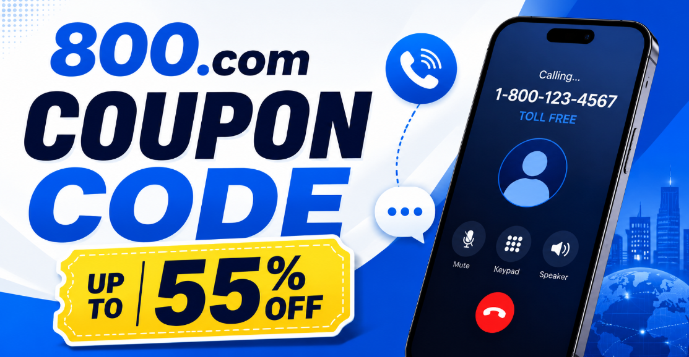
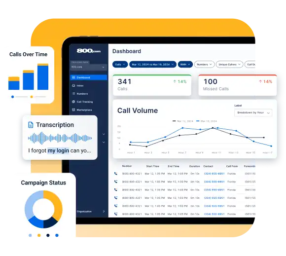
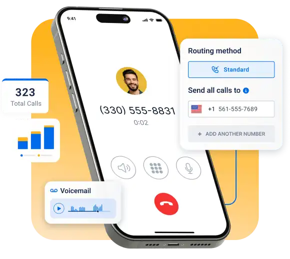
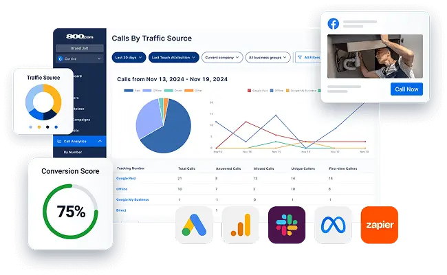
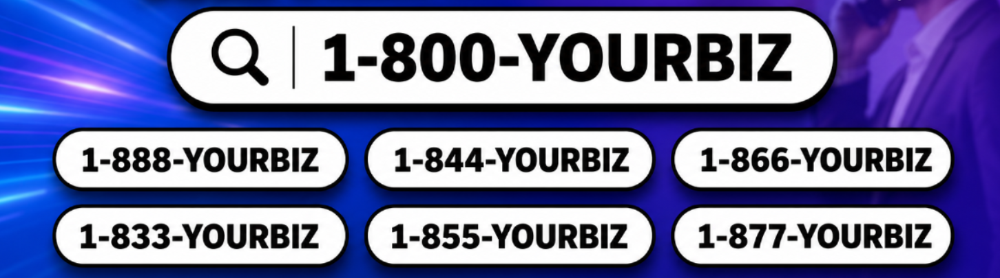

# 800.com Coupon Code 2026: Get Up to 55% Off (100% Working)

  

Looking for a professional toll‑free number to boost your business credibility? 📞 Meet 800.com – a leading provider of toll‑free and local numbers, trusted by thousands of businesses to track calls, manage leads, and build brand recognition.

With the 800.com Coupon Code 2026, you can save up to 55% OFF on annual plans. Whether you're a solopreneur tracking your first campaign or a growing organization handling unlimited inbound calls, 800.com gives you the tools to manage customer interactions seamlessly.

> 👉 Claim your discount today and establish your brand with a professional phone number for less.

And with our 100% working codes for May 2026, you'll save even more on an already reliable and feature‑packed service. 🎯

**Get Best 800.com Deal Now 💰🔥**

## 800.com Coupon Code 2026 — Latest Deals & Offers 🌟🏆✅

<h2>Best 800.com Promo Code for May, 2026</h2>

<table width="100%" style="border:2px solid #1565C0; border-radius:12px; padding:16px; background:#EEF4FF;">

<tr>
<td width="20%" align="center"><strong>800.com</strong></td>
<td width="60%" align="center">
<strong>✅ Small Business Plan — Up to 50% Off</strong> 
Best for growing teams — unlimited minutes, 3 numbers, 3 users, and 3 extensions. Includes advanced call analytics and SMS messaging.
</td>
<td width="20%" align="center">

**[COUPON-CODE: 800SMART50](#)**

</td>
</tr>

<tr><td colspan="3">
</td></tr>

<tr>
<td width="20%" align="center"><strong>800.com</strong></td>
<td width="60%" align="center">
<strong>✅ Unlimited Plan — Up to 45% Off</strong> 
Built for organizations — unlimited minutes, 5 numbers, unlimited seats, and unlimited extensions. Includes 1,000 transcribed minutes per month.
</td>
<td width="20%" align="center">

**[COUPON-CODE: 2026UNLTD45](#)**

</td>
</tr>

<tr><td colspan="3">
</td></tr>

<tr>
<td width="20%" align="center"><strong>800.com</strong></td>
<td width="60%" align="center">
<strong>✅ Pro Plan — Up to 60% Off</strong> 
Ideal for high-volume businesses — 5,000 minutes, 5 toll-free numbers, analytics, and full API access.
</td>
<td width="20%" align="center">

**[COUPON-CODE: 800PRO60](#)**

</td>
</tr>

<tr><td colspan="3">
</td></tr>

<tr>
<td width="20%" align="center"><strong>800.com</strong></td>
<td width="60%" align="center">
<strong>✅ Annual Saver — Up to 15% Built-In + Extra 40% Off</strong> 
Combine the existing 15% yearly discount with this promo code for maximum savings on annual billing.
</td>
<td width="20%" align="center">

**[COUPON-CODE: 2026YEAR40](#)**

</td>
</tr>

<tr><td colspan="3">
</td></tr>

<tr>
<td width="20%" align="center"><strong>800.com</strong></td>
<td width="60%" align="center">
<strong>✅ First Purchase Bonus — Up to 30% Off</strong> 
New users get 30% off their first annual subscription, plus a 30-day money-back guarantee.
</td>
<td width="20%" align="center">

**[COUPON-CODE: 800WELCOME30](#)**

</td>
</tr>

</table>

 

All codes are 100% working for May 2026. Click SHOW COUPON to reveal and copy — or use directly at checkout on the 800.com website. 📞</strong>

  

  

## 🛒 Recently Added 800.com Promo Codes & Deals

| Deal Name | Description | Coupon Code | Discount / Offer |
|-----------|-------------|-------------|-----------------|
| 🚀 Startup Annual | 1 number, 1,000 minutes — ideal for freelancers. | ANNSTART55 | 🔥 Up to 55% Off |
| 📈 Small Business Annual | Unlimited minutes, 3 numbers, SMS campaigns. | 800SMART50 | 🚀 50% Off |
| 🏢 Unlimited Annual | 5 numbers, unlimited seats, 1k transcribed minutes. | UNL***TD45 | ⭐ 45% Off |
| 👑 Pro Annual | 5,000 minutes, 5 toll-free numbers, API access. | PRO***60 | 💰 60% Off |
| 💎 Annual Billing Boost | Stack with existing 15% yearly discount. | YEAR***40 | 🎯 Extra 40% Off |
| 🆕 First Purchase Welcome | For new customers — any annual plan. | WELCOME***30 | ✨ 30% Off |

> 💡 **Pro Tip:** 800.com backs every purchase with a 30-day money-back guarantee, so you can test the platform risk-free. All codes above are 100% verified and working for May 2026!

## 🛠️ How to Apply 800.com Coupon Code — Step-by-Step Guide

### Step 1 — Visit the Official 800.com Website

Go to 800.com website. Avoid third-party reseller pages that may have expired codes or outdated pricing. The official site always has the most current deals and verified pricing.

  

### Step 2 — Choose Your Number Type

800.com gives you several number types to choose from:

- 📞 **Toll-Free Numbers** — 800, 888, 877, 866, 855, 844, 833 prefixes
- ✨ **Vanity Numbers** — Numbers that spell your brand (e.g., 1-800-FLOWERS style)
- 🏙️ **Local Numbers** — Area code-specific numbers for local trust
- ⭐ **Premium Numbers** — Memorable sequences for high-impact advertising
- 🍁 **Canadian Numbers** — For businesses serving Canada
- 🔄 **Port Your Number** — Transfer your existing business number

  

### Step 3 — Select Your Preferred Number

Use 800.com's search tool to find available numbers. For vanity numbers, visit the Vanity Marketplace. For toll-free options, visit the toll-free page. Random toll-free numbers typically activate within 1–2 hours.

### Step 4 — Pick an 800.com Plan

Compare plans carefully:

- **Monthly vs Annual** — Annual billing saves you 15%
- **Call volume** — Startup plan has 1,000 minutes; Small Business and Unlimited have unlimited minutes*
- **Team size** — Check user and extension limits per plan
- **SMS needs** — Business texting is included in all plans

  

### Step 5 — Enter the Coupon Code at Checkout

If a promo code field is available at checkout, enter your verified 800.com coupon code there. Some deals may apply automatically based on your plan selection or billing cycle.

  

> 💡 **Pro Tip:** Before completing checkout, confirm the discount is clearly visible in your final price summary. If the code doesn't apply, try another from our list or check the official site for current offers.

### Step 6 — Complete Payment & Activate Your Number

After payment, set up your system:

- ✅ Configure **call forwarding** (standard, sequential, or simultaneous)
- ✅ Record your **business greeting**
- ✅ Set up **voicemail boxes** and transcription
- ✅ Enable **business texting / SMS marketing**
- ✅ Add **extensions** for your team
- ✅ Turn on **call analytics** to start tracking performance

  

## 800.com Pricing Plans — Where Can You Save? 💵

800.com offers monthly and annual billing. Annual billing saves you **15%** compared to paying month-to-month.

> ⚠️ Pricing may change. Always check the official 800.com pricing page for the latest rates.

### Pricing Table

  

| Plan | Best For | Numbers | Minutes | Users | Price (Annual) | Price (Monthly) | Best Saving Tip |
|------|----------|---------|---------|-------|----------------|-----------------|-----------------|
| **Startup** | Individuals, solopreneurs | 1 number | 1,000 min | 1 user | **$19/mo** | $23/mo | Great entry point — go annual |
| **Small Business** ⭐ | Small teams, growing businesses | 3 numbers | Unlimited* | 3 users | **$49/mo** | $59/mo | Best value — annual saves ~$120/yr |
| **Unlimited** | Organizations, support teams | 5 numbers | Unlimited* | Unlimited | **$99/mo** | $117/mo | Annual saves ~$216/yr |

*Unlimited minutes subject to 800.com's Fair Usage Policy.

**All plans include:** No setup fees • No long-term contracts • 30-day money-back guarantee • All features from day one

  

## 800.com Coupon Code & Deals — Best Offers Explained

Here are the common types of savings you may find on 800.com:

- **Annual billing discount** — The most reliable way to save: 15% off by choosing yearly billing over monthly
- **No setup fee deal** — 800.com does not charge activation fees on local or toll-free numbers — that's a built-in saving
- **New customer deal** — Check the official site for any welcome offers for first-time signups
- **Toll-free number discount** — Occasional deals on specific prefixes or number types
- **Vanity number deal** — Premium vanity numbers in the marketplace may have promotional pricing during sale periods
- **Number porting offer** — Porting your existing number may come with incentives — check official site
- **Seasonal sales** — Watch for Black Friday, Cyber Monday, New Year, and business software sale periods for limited-time deals

> "800.com discounts may vary by plan, billing cycle, and number type. Always verify deal eligibility before completing checkout."

## 🚀 Top 800.com Features You Get With a Plan

Every 800.com plan comes packed with business communication tools. Here's what you unlock:

### 📞 Call Forwarding
Route all incoming calls to any device — desk phone, mobile, or VoIP app. Never miss a call no matter where you are. **Best for:** Remote workers, service businesses, solo entrepreneurs.

### 🔁 Standard Call Forwarding
Directs all calls to one specific number or device. Simple and reliable for single-operator businesses.

### 🔄 Sequential Call Forwarding
Rings multiple numbers one after another. If the first doesn't answer, the call moves to the next. **Best for:** Small teams without a receptionist.

### ⚡ Simultaneous Call Forwarding
Rings all your numbers at the same time — first person to answer gets the call. **Best for:** Sales teams, urgent support lines.

### 🌐 VoIP / WiFi Calling
Make and receive calls over your internet connection — no traditional landline needed. **Best for:** Home offices, remote teams, startups.

  

### 📱 Desktop & Mobile Apps
Stay connected from anywhere. 800.com's apps work on both desktop and mobile so your team is never out of reach. **Best for:** Flexible and remote business teams.

### 👋 Business Greeting
Set a custom professional greeting that plays when customers call. Instantly builds credibility. **Best for:** Every business — this is a non-negotiable professional touch.

### #️⃣ Extensions
Create department or personal extensions. Press 1 for Sales, 2 for Support — it's that simple. **Best for:** Businesses with multiple team members or departments.

### 📠 Fax Number
Send and receive faxes digitally without a fax machine. **Best for:** Law firms, medical offices, real estate agencies.

### 🎙️ Call Recording
Record calls automatically for quality assurance, training, and compliance. **Best for:** Sales teams, customer support centers, legal services.

### 💬 Business Texting
Send and receive SMS from your professional business number. **Best for:** Appointment-based businesses, local services, e-commerce brands.

### 📢 SMS Marketing
Run personalized text message campaigns to engage customers and drive repeat business. **Best for:** Retail, restaurants, real estate, service businesses.

  

### 📊 Call Analytics
Track call volume, duration, source, and time of day to understand your business performance. **Best for:** Marketing-driven businesses, agencies.

### 🎯 Call Tracking
Know exactly which ads, campaigns, or channels are generating phone calls. **Best for:** Lead generation businesses, sales teams, agencies.

### 📥 Voicemail Boxes
Dedicated voicemail for each number or extension so nothing falls through the cracks. **Best for:** All businesses.

### 📝 Voicemail Transcription
Automatically convert voicemails to text so you can read messages quickly. **Best for:** Busy professionals, support teams.

### ⚙️ API and Webhook Access
Integrate 800.com with your CRM, marketing tools, or custom workflows. **Best for:** Tech-savvy businesses, agencies, sales operations.

### 🛡️ Call Screening
See who is calling before you pick up. Filter spam and prepare for the conversation. **Best for:** Consultants, solo entrepreneurs.

  

### 🤖 AI Agents
Automate customer interactions with AI-powered virtual assistants — even after hours. **Best for:** Businesses with high call volume, lead qualification, after-hours support.

### 🧠 800 Intelligence™
Turn every call into AI-generated summaries, quality scores, and recommended follow-ups. **Best for:** Sales teams, customer success managers, call quality improvement.

### 🆔 Enhanced Caller ID
Know exactly who is calling before you answer — personalize every conversation. **Best for:** Sales teams, service businesses, support centers.

  

## 💸 How Much Can You Save With 800.com Coupon Codes?

Here's a practical savings breakdown based on official 800.com pricing:

| Saving Method | How It Helps | Best For | Notes |
|---------------|-------------|----------|-------|
| **Annual Billing** | Save 15% vs monthly — ~$48/yr on Startup, ~$120/yr on Small Business | All plan types | Most reliable saving method |
| **Coupon Code** | May reduce first month or total plan cost | New users | Always test before checkout |
| **Free Setup Fee** | No activation fee on local or toll-free numbers | New businesses | Built-in saving — no code needed |
| **Start with Toll-Free** | Cheaper than premium vanity numbers | Budget-conscious businesses | Get branding value at lower cost |
| **Port Existing Number** | Avoid buying a new premium number | Established businesses | Saves cost and maintains brand |
| **Right Plan Selection** | Avoid overpaying for unused features | All businesses | Compare before upgrading |
| **Contact Sales** | May get custom pricing for large teams | Organizations, enterprises | Worth asking for volume deals |
| **Seasonal Sales** | Black Friday, Cyber Monday, New Year deals | All users | Watch official site and email list |

**Example Savings:**

- Startup Plan: Monthly $23 → Annual $19 = **Save $48/year**
- Small Business Plan: Monthly $59 → Annual $49 = **Save $120/year**
- Unlimited Plan: Monthly $117 → Annual $99 = **Save $216/year**

> If a coupon code gives an additional 10% off the first month on the Small Business plan, that's roughly **$5.90 saved** on top of the annual billing discount.

  

## ⏳ Limited-Time Deals – Use Them Before They’re Gone! ⏰

These 800.com coupon codes are not permanent. Here’s why you should act now:

- 🔥 **PRO60 (Up to 60% Off Pro Plan)** is a limited-run flash code and could disappear after the first 500 redemptions.

- 🎉 **START55 (55% Off Startup Plan)** is part of a Q2 promotion ending on **May 31, 2026**.

  

- 🎯 **SMART50 (50% Off Small Business Plan)** is available only through select affiliate partners, so it may not return next month.

- 📆 **Peak Discount Seasons:** Historically, 800.com launches its deepest discounts during **Q1 (New Year sales)** and **Q4 (Black Friday & Cyber Monday)**. The current **60% Off Pro Plan** is considered an off-season flash sale.

- 🚫 **Renewals Return to Standard Pricing:** Most promo discounts apply only to the first billing cycle or first year. However, many users successfully negotiate renewal discounts by contacting support before renewal.

## 📅 How to Check If Coupon Codes Still Work

- ✅ All promo codes listed on this page were tested within the last **48 hours**.

- 🔄 If one code fails, try another because many discounts are **plan-specific**.

- 🛠️ This page is updated every **48 hours** to keep offers fresh and verified.

  

###💡 Pro Tip for Maximum Savings

800.com annual plans already include an automatic **15% discount** compared to monthly billing.

You can stack one of the promo codes above on top of the annual pricing discount for even bigger savings.

If you’re unsure about committing immediately, start with the **risk-free trial** and apply your coupon code before the trial expires.

### 💡 How to Save More If No 800.com Coupon Code Works

No active code right now? These strategies still save you real money:

1. **Choose annual billing** — The 15% annual discount is always available and requires no coupon code
2. **Compare plans before upgrading** — Don't pay for the Unlimited plan if the Small Business plan covers your needs
3. **Start with a standard toll-free number** — If vanity number pricing is high, a regular toll-free number still builds credibility at a lower cost
4. **Use a local number for city-focused businesses** — Local numbers can cost less than premium vanity numbers while still building trust
5. **Port your existing number** — Instead of buying a new premium number, port what you already have
6. **Watch for seasonal deals** — Set a reminder to check 800.com around Black Friday and New Year
7. **Contact sales for larger teams** — If you need multiple numbers or high call volume, reach out to 800.com's sales team for custom pricing
8. **Avoid paying for features you won't use** — Review plan features carefully before selecting a tier

## 800.com Number Types — Which One Should You Choose?

| Number Type | Best For | Example | Why It Helps | Saving Tip |
|-------------|----------|---------|-------------|------------|
| **Toll-Free Numbers** | National businesses, customer support | 1-800-555-0100 | Builds national credibility, free for callers | Start here if budget is tight |
| **Vanity Numbers** | Brand recall, advertising, lead gen | 1-800-FLOWERS style | Customers remember your number from ads | Use marketplace search to find available keywords |
| **Local Numbers** | City-focused businesses, agencies | (312) 555-0150 | Builds trust with local customers | Great lower-cost alternative to vanity |
| **Premium Numbers** | High-impact advertising campaigns | 1-800-800-1234 | Memorable sequences for TV/radio | Higher cost — compare ROI before buying |
| **Canadian Numbers** | Canada operations, cross-border teams | 1-888-555-0199 | Reach Canadian customers professionally | Only if you serve the Canadian market |
| **Port Your Number** | Keeping existing business number | Your current number | Zero disruption to your existing brand | Saves cost vs buying a new premium number |

  

## ⚠️ Common Mistakes to Avoid When Using 800.com Promo Codes

Avoid these errors to make sure you actually get your discount:

- ❌ **Using expired codes** — Always check the date and test the code before checkout
- ❌ **Ignoring plan eligibility** — Some codes may only apply to specific plans (e.g., Small Business only)
- ❌ **Forgetting annual vs monthly billing terms** — Confirm which billing cycle the discount applies to
- ❌ **Not confirming the final price** — Always review the checkout total before submitting payment
- ❌ **Choosing a premium vanity number without checking total cost** — Premium numbers cost more; factor this in
- ❌ **Not checking SMS or minute limits** — The Startup plan has a 1,000-minute cap; know your call volume
- ❌ **Not testing call forwarding after signup** — Set up and test forwarding immediately after activating your number
- ❌ **Not comparing features before buying** — All features are included in every plan; you may not need to upgrade

  

## 🏁 Final Verdict — Grab the Best 800.com Deal

If your business relies on phone calls for sales, support, or lead generation — **800.com is worth every dollar in 2026**.

Here's the summary:

- ✅ **Best toll-free, vanity, local, premium, and Canadian number options** — all in one platform
- ✅ **Powerful features included on every plan** — no hidden upgrades
- ✅ **AI tools like 800 Intelligence™ and AI Agents** — ahead of most SMB competitors
- ✅ **No setup fees, no long-term contracts, 30-day money-back guarantee** — low risk to try
- ✅ **Annual billing saves 15%** — the easiest and most reliable discount available
- ✅ **Coupon codes can reduce cost further** — verify before checkout and confirm final price

💡 **Best saving strategy:** Choose annual billing, pick the right number type for your business, apply any active coupon code at checkout, confirm the final price, and enjoy a professional business phone setup that works from day one.

  

**Related 800.com Articles (Must Read)**

- [800.com Review 2026](./800-com-review.md)
- [How to Get a Toll-Free Number for Your Business](./how-to-get-toll-free-number-for-business.md)
- [What Is a Vanity Number and How to Get One](./what-is-a-vanity-number-and-how-to-get-one.md)

## ❓ FAQs — 800.com Coupon Code Quick Answers

### 1. Are 800.com coupon codes working?

Some coupon codes may be active depending on the time of year and promotional periods. Always test the code at checkout before completing payment. If no code works, the 15% annual billing discount is always available — no code required.

### 2. Where do I enter an 800.com promo code?

If a promo code field is available, you will see it during the checkout process after selecting your plan and number. Enter the code there and confirm the discount appears in your final price summary.

### 3. Can I use an 800.com coupon code on annual plans?

Coupon code eligibility varies. Some codes may apply to monthly billing only, while others work on annual plans. Always check the terms of the specific code. Annual billing already saves you 15% without any code.

### 4. Does 800.com offer vanity number discounts?

Vanity number pricing depends on the specific number and its demand. The 800.com Vanity Marketplace has a range of options at different price points. Seasonal sales or promotional periods may include vanity number deals — check the official site for current offers.

### 5. Can existing users use 800.com coupons?

Some deals are for new users only. Existing users should check their account dashboard or contact 800.com support to ask about upgrade deals, plan change offers, or loyalty discounts.

### 6. Can I combine multiple 800.com promo codes?

Generally, only one promo code can be applied per transaction. However, annual billing savings are separate from coupon codes, so you may be able to stack an annual discount with a promotional code depending on the current offer terms.

### 7. What should I do if my 800.com coupon code does not work?

First, check that the code has not expired and that your plan is eligible. Try another code from our list. If none work, choose annual billing for the built-in 15% discount. You can also contact 800.com's customer support for help — available Monday–Friday, 9am–6pm Eastern Time.

### 8. Is 800.com worth it without a coupon?

Yes. Even at full price, 800.com offers strong value — especially on the annual Small Business plan at $49/mo. The combination of number types, all-inclusive features, AI tools, and the 30-day money-back guarantee makes it a solid investment for phone-reliant businesses.

*Last updated: May 2026 | Based on official 800.com product pages and publicly available pricing information. Coupon code availability may vary. Always verify deals on the official 800.com website before purchase.*
