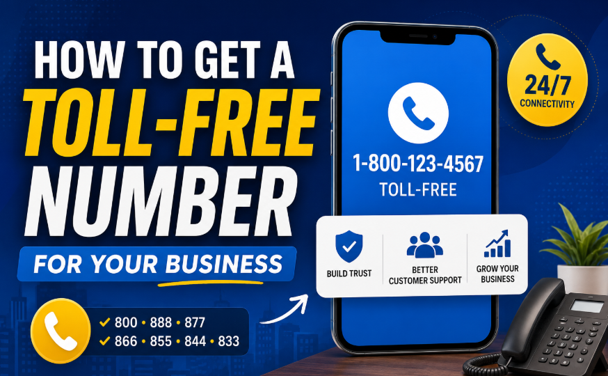
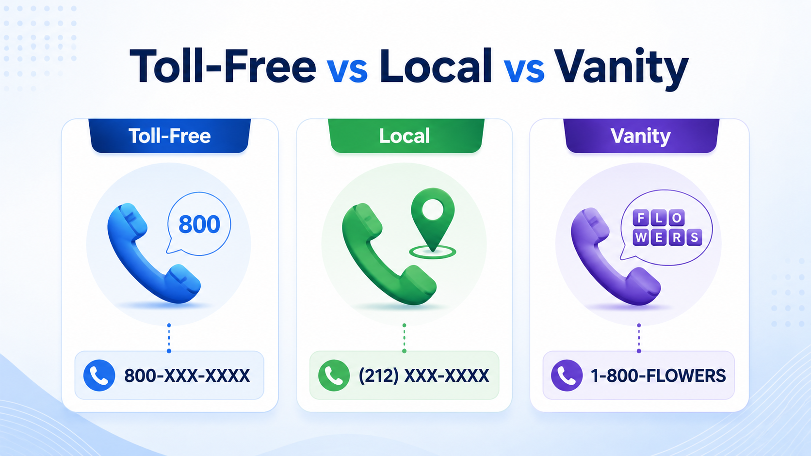

# How to Get a Toll-Free Number for Your Business (2026 Guide)

## Introduction

📞 Ever called a business and noticed they have a 1-800 number? There's a reason big brands use them — and it's not just about looking fancy. A toll-free number instantly signals that your business is serious, accessible, and customer-friendly. Whether you're a solo consultant, an e-commerce store, or a growing startup, having a professional business phone number can be a real game-changer.

Here's the truth: customers are more likely to trust a business with a toll-free number. It tells them you've invested in proper communication, that you're reachable, and that you care about their experience. And the good news? Getting one is a lot easier and more affordable than most people think. 🎯

In this guide, you'll learn exactly **how to get a toll-free number for your business** — step by step. We'll cover what toll-free numbers are, how they work, what they cost, the best providers to consider, and all the features you should look for. No jargon. No fluff. Just practical, honest advice. Let's dive in. 🚀

---

## What Is a Toll-Free Number? 📱

A toll-free number is a special type of phone number that lets customers call your business without paying any call charges. The cost of the call is covered by the business receiving it — not the caller. This makes it easier and more attractive for customers to reach you, especially if they're calling from across the country.

You've probably seen these numbers all your life. They look like this:

- **1-800-XXX-XXXX**
- **1-888-XXX-XXXX**
- **1-877-XXX-XXXX**

The "800," "888," "877," and similar codes at the beginning are called **toll-free prefixes**. In the United States, Canada, and many other countries in the North American Numbering Plan (NANP), these numbers are instantly recognized as free-to-call by the customer.

Unlike a regular local number tied to a geographic area, a toll-free number has no location attached to it. That means your business can operate anywhere and still project a national, professional presence.

---

## How Does a Toll-Free Number Work? 🔄

When a customer dials your toll-free number, the call travels through the public telephone network to a **toll-free service provider** — also called a Responsible Organization (RespOrg). This provider routes the call to whatever phone you've designated: your mobile phone, a desk phone, an office phone system, or a virtual phone service.

Here's a simplified breakdown of what happens behind the scenes:

1. **Customer dials** your toll-free number.
2. The call hits the **telecom network** and is identified as a toll-free route.
3. It's forwarded to your **toll-free provider's system**.
4. The provider routes the call to **your chosen destination** — could be a VoIP app, a cell phone, a call center, or a SIP trunk.
5. You pick up and the call connects. The customer pays nothing. You pay (usually a per-minute or flat monthly rate, depending on your plan).

Most modern toll-free services now work over **VoIP (Voice over Internet Protocol)**, which means calls travel over the internet rather than traditional phone lines. This makes them cheaper to operate, easier to manage, and packed with smart features like IVR menus, call recording, analytics, and mobile apps.

You don't need a physical office or a landline to use a toll-free number. Many business owners manage their toll-free calls entirely from a smartphone app. 📲

---

## Benefits of Getting a Toll-Free Number for Business ✅

Getting a toll-free number isn't just about looking bigger than you are. There are real, practical benefits — especially if you're building a brand, handling customer support, or running marketing campaigns.

**🏆 Builds Business Credibility**
A toll-free number immediately signals professionalism. Customers associate 1-800 numbers with established businesses. Even if you're a one-person operation, having this type of number levels the playing field.

**🤝 Makes Customer Support Easier**
When customers can call you for free, they're more likely to actually reach out — and that means fewer abandoned carts, fewer unresolved issues, and higher customer satisfaction.

**🌎 Works Nationwide**
A toll-free number has no geographic restriction. Whether your customer is in New York or Los Angeles, they can call the same number. That's ideal for businesses that serve clients across the country.

**🎨 Boosts Your Brand**
Vanity numbers like **1-800-FLOWERS** or **1-800-CONTACTS** are impossible to forget. Even a standard toll-free number becomes part of your brand identity when used consistently in ads, packaging, and your website.

**📊 Supports Call Tracking**
Most toll-free providers let you track where calls come from — which ad, which landing page, which campaign. This is gold for marketers trying to measure ROI.

**💼 Improves Your Professional Image**
Having a dedicated business number (instead of your personal cell) means you can set business hours, record voicemails, and separate work from personal life — all of which make you look far more professional.

**👥 Useful for Sales and Support Teams**
If you have a team, toll-free services let you build out call queues, ring groups, and IVR menus so every caller reaches the right person. That means fewer missed calls and better customer experiences.

---

## Toll-Free Number Prefixes Explained — 800, 888, 877, 866, 855, 844 & 833 🔢

All of these prefixes work exactly the same way for the caller — they're all free to dial. The difference is simply availability and brand recognition.

| Prefix | Notes |
|--------|-------|
| **800** | The original toll-free prefix. Most recognized and trusted. Highly desirable but many numbers are taken. |
| **888** | Introduced in 1996. Nearly as trusted as 800. Good availability. |
| **877** | Added in 1998. Less common but still widely recognized. |
| **866** | Added in 2000. Plenty of good numbers still available. |
| **855** | Added in 2010. Good for businesses that want a newer, distinct prefix. |
| **844** | Added in 2013. Large inventory of available numbers. |
| **833** | Most recently added (2017). Best availability for custom or vanity numbers. |

> 💡 **Pro tip:** If you want a specific vanity number (like 1-800-PLUMBER), you may need to look across multiple prefixes since 800 versions of popular words are almost always taken. The number **1-833-PLUMBER** works just as well and may be available.

---

## Toll-Free Number vs Local Number vs Vanity Number ⚖️

Not sure which type of number is right for you? Here's a quick comparison:

| Feature | Toll-Free Number | Local Number | Vanity Number |
|---------|-----------------|--------------|---------------|
| **Customer cost to call** | Free | May incur charges | Free (if toll-free) |
| **Geographic association** | None (national) | Tied to area code | None |
| **Brand memorability** | Medium | Low | Very High |
| **Cost to business** | Monthly + per-min | Low | Higher (premium) |
| **Availability** | Good (varies by prefix) | Very high | Limited |
| **Best for** | National brands, support lines | Local service businesses | Marketing-heavy brands |
| **Customer trust** | High | Medium (local feel) | High |

**Who should get what?**

- 🏢 **Small business with national reach** → Go with a toll-free number. It's affordable and professional.
- 🔧 **Local plumber, dentist, or salon** → A local number may work fine, but a toll-free number adds credibility.
- 📣 **Brand running TV/radio ads** → Get a vanity toll-free number. Memorability is everything in advertising.

---

## How to Get a Toll-Free Number for Your Business — Step-by-Step Guide 🛠️

Here's the straightforward path from zero to a working toll-free number.

### Step 1: Choose the Right Toll-Free Number Provider 🔍

Your provider is the company that assigns you a toll-free number and routes your calls. Not all providers are created equal — here's what to compare:

- **Pricing:** Look at monthly plan fees, per-minute charges, and setup costs.
- **Included minutes:** Some plans include a set number of minutes; others are pay-as-you-go.
- **Call quality:** Read reviews specifically about audio quality and reliability.
- **Features:** Do you need SMS? Call recording? IVR? CRM integrations? Make sure the provider offers what you actually need.
- **Mobile app:** If you want to manage calls from your phone, check that the app is well-rated.
- **Customer support:** Can you reach a human if something goes wrong?
- **Number portability:** Can you bring your existing number to this provider, or take your new number if you switch?

Popular providers include Nextiva, Grasshopper, Dialpad, RingCentral, 800.com, and OpenPhone — we compare these in more detail below.

### Step 2: Pick Your Toll-Free Prefix or Vanity Number ✨

Once you've chosen a provider, you'll search their number inventory for an available number.

**Standard toll-free number:** Search by prefix (800, 888, 877, etc.) and pick something clean and easy to remember. Avoid numbers with confusing sequences like 4-4-4-5-4-5.

**Vanity number:** This is where creativity pays off. Think about your business name, your service, or a memorable phrase:
- A locksmith might want **1-800-UNLOCKS**
- A tax firm could use **1-800-TAXHELP**
- A cleaning service might go for **1-833-SPOTLESS**

Vanity numbers are excellent for marketing because customers can remember them from a billboard or radio ad without writing anything down. 📋

**Tips for picking a good number:**
- Shorter is better (avoid numbers where callers have to count digits)
- Easy to say out loud (test it — say it to a friend)
- Works well on print, audio, and digital ads

### Step 3: Select a Business Phone Plan 📋

After choosing your number, you'll select a pricing plan. Most providers offer tiered plans. Here's what to look at:

- **Monthly base fee:** What you pay regardless of call volume.
- **Included minutes:** How many inbound minutes before per-minute charges kick in.
- **Per-minute rate:** Important if you expect high call volume.
- **Number of users:** Can multiple team members use the same system?
- **SMS/MMS:** Can you text from your toll-free number? (Not all plans include this.)
- **Voicemail transcription:** Converts voicemails to text — very handy.
- **Call recording:** Useful for training and compliance.
- **Analytics dashboard:** Track calls, missed calls, call duration, and peak times.
- **Add-ons:** Fax, international calls, extra numbers, CRM integrations.

Start with the lowest plan that covers your expected call volume, and upgrade if needed. Most providers allow you to scale up without losing your number.

### Step 4: Set Up Call Routing, Voicemail & Business Hours ⚙️

This step is where many businesses drop the ball. A toll-free number is only as good as the experience callers have when they dial it.

**Call forwarding:** Route calls to your mobile phone, office desk phone, a team member, or a virtual receptionist. You can set up rules based on time of day, day of week, or caller location.

**IVR menu (auto-attendant):** This is the "Press 1 for sales, press 2 for support" system. Even a simple one-level IVR makes your business feel much more professional.

**Voicemail greeting:** Record a professional greeting. Include your business name, hours, and an instruction (e.g., "Leave your name and number and we'll call back within one business day").

**Business hours rules:** Set your system to answer calls during business hours and send after-hours calls to voicemail or an emergency forwarding number.

**Holiday hours:** Most providers let you schedule special routing for holidays in advance — so you're not manually changing settings on Christmas morning. 🎄

**Team routing:** If you have a support or sales team, you can set up round-robin routing (calls go to available agents in turn) or simultaneous ringing (all phones ring at once).

### Step 5: Test Your Toll-Free Number Before Using It Publicly 🧪

Before you put your new number on your website, business cards, or marketing materials — test everything.

**Call from multiple devices:**
- Your own mobile phone
- A landline
- A friend or colleague's phone from a different carrier

**Check these things:**
- Does the call connect cleanly?
- Does the IVR menu work as expected?
- Do calls forward to the right destination?
- Does voicemail kick in correctly when you don't answer?
- Is the voicemail greeting professional and clearly audible?
- Does caller ID display correctly?
- Does call recording work if you've enabled it?

Only after a clean test pass should you start using your number publicly. A bad first impression on a business call is hard to recover from.

---

## How Much Does a Toll-Free Number Cost? 💰

Toll-free number pricing varies widely depending on the provider, the plan, and the features you choose. Here's a realistic breakdown of what to expect:

| Cost Component | Typical Range | Notes |
|---------------|--------------|-------|
| **Monthly plan fee** | $10 – $100+/month | Varies by provider and features included |
| **Per-minute charges** | $0.01 – $0.06/minute | Applies to inbound calls beyond included minutes |
| **Number setup fee** | $0 – $30 | Some providers waive this |
| **Vanity number premium** | $0 – $500+ | Highly desirable numbers cost more |
| **Additional users** | $10 – $30/user/month | For team plans |
| **Call recording** | Often included or $5–$15/month add-on | May vary by provider |
| **SMS/MMS** | Often included or $5–$10/month add-on | Check if included in base plan |
| **International calls** | $0.02 – $0.10+/minute | Depends on destination and provider |

**What's the cheapest way to get started?**
Providers like Grasshopper start around $14–$26/month for a single user. OpenPhone offers competitive pricing for small teams. If you're just starting out and call volume is low, a basic plan with included minutes is usually the most cost-effective option.

**⚠️ Watch out for:**
- Overage charges if you exceed included minutes
- Fees for porting your number to another provider
- Hidden fees for features you assumed were included (always read the fine print)

---

## Best Toll-Free Number Providers to Compare 🏅

Here's an overview of popular toll-free number providers to help you make an informed choice:

| Provider | Best For | Key Features | Pricing Style | Pros | Ideal User |
|----------|---------|-------------|--------------|------|------------|
| **Nextiva** | Mid-to-large teams | VoIP, CRM integrations, analytics, video | Per user/month | Reliable, feature-rich | Growing businesses and call centers |
| **Grasshopper** | Solo entrepreneurs & small biz | Mobile app, call forwarding, voicemail | Flat monthly | Simple, no per-minute fees | Freelancers, small teams |
| **Dialpad** | Modern teams using AI | AI transcription, Google Workspace integration | Per user/month | Smart AI features | Tech-savvy teams |
| **RingCentral** | Enterprise and complex setups | Full UCaaS suite, 99.999% uptime SLA | Per user/month | Enterprise-grade reliability | Large businesses |
| **800.com** | Vanity numbers | Large vanity number inventory, easy setup | Monthly + per-min | Easy to use, great vanity selection | Marketing-focused businesses |
| **OpenPhone** | Startups and small teams | Shared inboxes, SMS, Slack integration | Per user/month | Affordable, modern UX | Startups, remote teams |

> *Note: Pricing may vary. Always check provider websites directly for current plans.*

---

## Important Features to Look for in a Toll-Free Number Service 🔎

Not all toll-free services offer the same features. Here are the most important ones to evaluate:

**📲 Call Forwarding**
Essential. Lets you route calls to any device. Look for advanced options like time-based routing and failover forwarding.

**🤖 Auto-Attendant / IVR**
The virtual receptionist that greets callers and routes them to the right department. Even a simple one-level menu is far better than nothing.

**📧 Voicemail-to-Email**
Sends you an audio file (or text transcription) of voicemails directly to your inbox. Never miss a message, even when you're in a meeting.

**💬 Business Texting (SMS)**
The ability to send and receive texts from your toll-free number. Increasingly important as customers prefer texting for quick questions.

**⏺️ Call Recording**
Records inbound and/or outbound calls for quality assurance, compliance, or training. Useful for any team that handles customer issues.

**📈 Call Analytics**
Dashboards showing call volume, peak call times, missed calls, call duration, and more. Helps you staff appropriately and measure campaign performance.

**📱 Mobile App**
Lets you manage your business number from your smartphone. Essential for remote or mobile business owners.

**🔗 CRM Integrations**
Connects your phone system with tools like Salesforce, HubSpot, or Zoho so call data automatically syncs with your customer records.

**👤 Team Extensions**
Lets you assign individual extensions to team members so callers can reach the right person directly.

**🛡️ Spam Protection**
Filters out robocalls and spam callers before they hit your queue. Saves time and reduces frustration.

---

## Pros & Cons of Toll-Free Numbers for Businesses ⚖️

| ✅ Pros | ❌ Cons |
|--------|--------|
| Professional, credible image | Monthly cost even if call volume is low |
| Easy for customers to remember | Per-minute charges can add up with high volume |
| Nationwide reach with no geographic limits | Popular 800 numbers may be unavailable |
| Improves customer support experience | Vanity numbers can cost significantly more |
| Supports call tracking for marketing | Not always necessary for hyper-local businesses |
| Works on mobile — no office needed | Setup learning curve for routing and IVR |
| Can port to another provider if needed | Some providers lock in contracts |

---

## Common Mistakes to Avoid When Getting a Toll-Free Number ❌

**🔴 Choosing a Hard-to-Remember Number**
A number like 1-800-447-2938 is forgettable. If you're spending money on a toll-free number, make it count — opt for patterns or a vanity number.

**🔴 Ignoring Call Routing Setup**
Getting a number and forwarding everything to your cell with no IVR or voicemail is a wasted opportunity. Take the time to set up proper routing from day one.

**🔴 Not Checking for Hidden Fees**
Always read the fine print. Some providers advertise low monthly rates but charge heavily for per-minute usage, porting, or premium features.

**🔴 Picking a Provider Without SMS Support**
Many customers prefer to text rather than call. If your provider doesn't support SMS on toll-free numbers, you're missing out on a communication channel your customers actually want.

**🔴 Forgetting to Test Voicemail**
A blank or default voicemail message is unprofessional. Always record a custom greeting before going live.

**🔴 Not Tracking Calls from Campaigns**
If you're running ads, use unique toll-free numbers for each campaign. This lets you measure exactly which ads are driving calls.

**🔴 Choosing a Plan Without Enough Minutes**
Underestimating call volume leads to overage charges. Track your call usage for the first 60–90 days and adjust your plan accordingly.

---

## Is a Toll-Free Number Worth It for Small Businesses? 🤔

**✅ Yes, it's worth it if…**

- You run an **e-commerce store** and customers need to call about orders, returns, or questions.
- You're a **service business** (consulting, insurance, real estate) where trust and accessibility matter.
- You're running **marketing campaigns** and want to track inbound calls.
- You serve **customers across multiple cities or states** and want a single unified contact number.
- You want to **project a larger, more professional image** than your actual size suggests.
- You have a **customer support function** where response time and accessibility are key.

**❌ It may not be necessary if…**

- You're a **strictly local business** with a loyal repeat customer base (a neighborhood bakery, for example).
- You **rarely take inbound calls** and primarily use email or chat.
- You're in an **early pre-revenue stage** and every dollar is critical — local or personal numbers can work temporarily.
- Your customers are always **in the same city** and prefer calling a familiar local area code.

The bottom line: if your business competes for customers beyond your local area, a toll-free number is almost always worth the investment. For very local, very low-call-volume businesses, it's optional.

---

## Final Verdict — Best Way to Get a Toll-Free Number 🏁

So, what's the best approach? **How to get a toll-free number for your business** really comes down to three things: choosing the right provider, picking a memorable number, and setting up your call routing properly before you go live.

Here's our honest recommendation based on your situation:

| Business Type | Recommended Approach |
|--------------|----------------------|
| **Solo entrepreneur or freelancer** | Grasshopper or OpenPhone — simple setup, flat pricing, solid mobile app |
| **Small e-commerce or service business** | 800.com or Nextiva — good vanity number selection and easy call management |
| **Growing sales team** | Nextiva or Dialpad — CRM integrations, analytics, and team features |
| **Customer support center** | RingCentral — enterprise-grade reliability, advanced routing, and team management |
| **Marketing-focused brand** | 800.com or any provider with strong vanity number inventory — branding is your #1 asset |
| **Local service business** | Consider starting with a local number first, then adding a toll-free when you scale |

Don't overthink it. Start with a provider that fits your current budget and call volume. Most let you upgrade, add numbers, or port out if you need to switch. The most important thing is to get a number, set it up properly, and start building the professional communication experience your customers deserve. 💪

Ready to take the next step? Compare a few providers, pick your number, and have your toll-free line live by the end of the week. 🚀

---

## FAQs — Toll-Free Number Quick Answers ❓

### 1. How do I get a toll-free number for my business?

Sign up with a toll-free number provider like Nextiva, Grasshopper, or 800.com. Choose your number, select a plan, and set up call routing. Most providers let you get started quickly.

### 2. Is a toll-free number free for customers?

Yes, customers calling your toll-free number usually pay nothing. The cost is paid by the business through its provider plan.

### 3. Can I get a 1-800 number for my business?

Yes, but specific 800 numbers are limited. If your desired 800 number is not available, you can choose prefixes like 888, 877, 866, 855, 844, or 833.

### 4. What is the cheapest way to get a toll-free number?

The cheapest option is usually a basic virtual phone provider or a business phone plan with a toll-free number included. Some providers may also offer pay-as-you-go pricing.

### 5. Can I use a toll-free number on my mobile phone?

Yes. Most modern toll-free providers offer mobile apps that let you make and receive calls from your smartphone without sharing your personal number. 📱

### 6. What is a vanity toll-free number?

A vanity toll-free number uses letters to spell a word or phrase, like **1-800-FLOWERS**. These numbers are easier to remember and useful for advertising.

