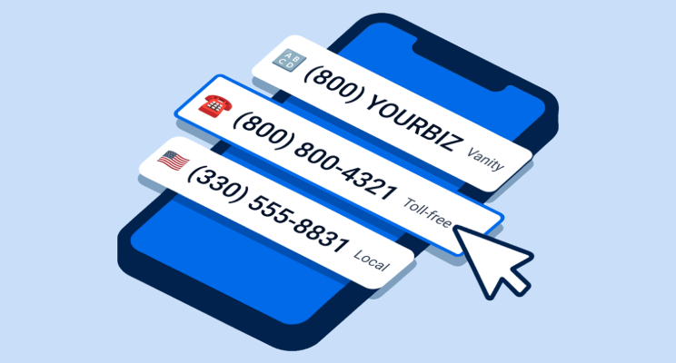
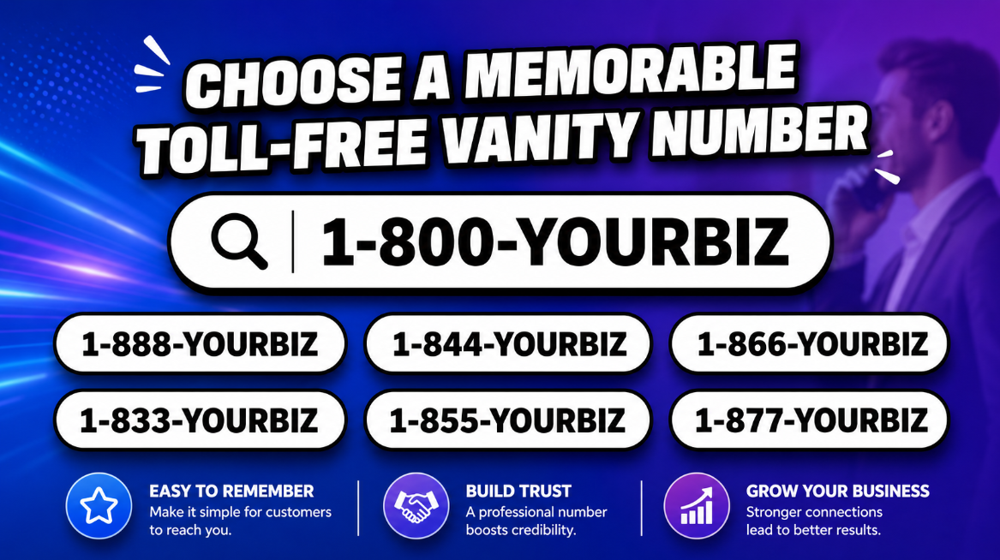

# What Is a Vanity Number & How to Get One? (2026)

  

📞 Imagine running a radio ad and your phone number is just… **1-800-447-2938**. Good luck getting anyone to remember that. Now imagine that same ad ends with **"Call 1-800-FLOWERS"** — and suddenly, everyone knows exactly who you are and how to reach you. That's the power of a vanity number.

A vanity number isn't just a phone number. It's a branding tool, a marketing asset, and a trust signal — all rolled into one. The best ones are so memorable that customers don't even need to write them down. They hear it once and it sticks. 🎯

In this guide, you'll learn exactly **what a vanity number is**, how it works, the different types available, what they cost, and how to get one for your business — step by step. Whether you're a small business owner, a marketer, or just exploring your options, this is everything you need to know in one place. Let's get into it. 🚀

---

## 📌 What Is a Vanity Number? 📱

A vanity number is a custom phone number that's designed to be easy to remember. Instead of a random string of digits, it either spells out a word or phrase using the letters on a phone keypad, or uses a repeated/patterned sequence of numbers that sticks in your memory.

**Examples of vanity numbers:**

- **1-800-FLOWERS** → spells the business name
- **1-800-GOT-JUNK** → spells the service offered
- **1-877-KARS-4-KIDS** → spells a memorable phrase
- **1-888-222-2222** → uses a repeating number pattern

On a phone keypad, each number corresponds to letters:

| Number | Letters |
|--------|---------|
| 2 | A, B, C |
| 3 | D, E, F |
| 4 | G, H, I |
| 5 | J, K, L |
| 6 | M, N, O |
| 7 | P, Q, R, S |
| 8 | T, U, V |
| 9 | W, X, Y, Z |

So **1-800-FLOWERS** actually dials as **1-800-356-9377**. The word is just the memorable version customers use.

Vanity numbers are most commonly toll-free (starting with 800, 888, 877, 866, 855, 844, or 833), but they can also be local numbers with a familiar area code. More on that below.

---

## 📌 How Does a Vanity Number Work? 🔄

Vanity numbers work exactly like any other phone number — the "word" version is simply a human-friendly way to remember the digits underneath.

Here's what happens when someone dials your vanity number:

1. **Customer dials** the vanity number (e.g., 1-800-TAXHELP).
2. Their phone automatically **converts letters to digits** (T=8, A=2, X=9, H=4, E=3, L=5, P=7 → 829-4357).
3. The call routes through the **telecom network** to your toll-free or VoIP provider.
4. Your provider **forwards the call** to wherever you've set it up — your mobile, office phone, call center, or virtual phone system.
5. The call connects. The customer pays nothing (on toll-free). You pay based on your plan.

Most modern vanity numbers run on **VoIP (Voice over Internet Protocol)** systems, which means you don't need a physical phone line. You can manage everything from a mobile app, forward calls to any device, set up IVR menus, record calls, and track analytics — all from one dashboard.

---

## 📌 Types of Vanity Numbers 🗂️

Not all vanity numbers look the same. Here are the main types:

### 📞 Toll-Free Vanity Numbers

These are the most popular. They use toll-free prefixes (800, 888, 877, 866, 855, 844, 833) and spell out a word or phrase. Customers call for free, and the business pays.

**Best for:** National brands, e-commerce businesses, customer support lines, marketing campaigns.

**Examples:**
- 1-800-CONTACTS
- 1-888-GO-GEICO
- 1-877-KARS-4-KIDS

### 🏙️ Local Vanity Numbers

These use a real geographic area code but are customized to spell something or use a memorable pattern. They give a business a local feel while still being memorable.

**Best for:** Local service businesses, regional companies, businesses wanting a community presence.

**Examples:**
- (512) GET-JUNK → Austin, Texas area
- (212) 222-2222 → New York City area

### 🔢 Pattern/Repeating Vanity Numbers

These don't spell a word — instead, they use a repeated or sequential digit pattern that's easy to recall.

**Best for:** Any business that wants a memorable number without needing to spell something specific.

**Examples:**
- 1-800-222-2222
- 1-888-555-1000
- (312) 100-1000

---

## 📌 Benefits of Getting a Vanity Number for Your Business ✅

Vanity numbers aren't just about looking cool. They deliver real, measurable business benefits.

**🧠 Instant Brand Recall**
A word-based number is dramatically easier to remember than a random string of digits. When a customer hears your ad once, they can recall the number without writing it down. That means more calls from every impression your ad gets.

**🏆 Projects Professionalism and Credibility**
A toll-free vanity number signals that your business is established and serious. Smaller businesses often use vanity numbers specifically to level the playing field against larger competitors.

**📣 Makes Advertising More Effective**
Vanity numbers are ideal for radio, TV, print, and billboard advertising — channels where customers can't click a link. A memorable number gives your audience something to act on even after the ad is over.

**📊 Supports Call Tracking and Marketing ROI**
You can use different vanity numbers for different campaigns and track which ones drive the most calls. This gives you clear data on which ads are performing and which aren't.

**🌎 Works Nationwide (with Toll-Free)**
A toll-free vanity number has no geographic restriction. Whether your customer is in Miami or Seattle, they call the same number — for free.

**🤝 Builds Customer Trust**
Customers are more likely to call a business with a memorable, professional number. It signals that you're real, established, and committed to being reachable.

**📈 Improves Conversion Rates**
Studies and industry reports consistently show that memorable phone numbers receive more calls than random ones. More calls mean more opportunities to convert prospects into paying customers.

**💼 Separates Business from Personal**
A dedicated vanity number keeps your personal cell number private while giving customers a professional way to reach you.

---

## 📌 Vanity Number vs Toll-Free Number vs Local Number ⚖️

People often confuse these terms. Here's a clear breakdown:

| Feature | Vanity Number | Toll-Free Number | Local Number |
|---------|--------------|-----------------|--------------|
| **What makes it special** | Spells a word or uses a pattern | Free for customers to call | Tied to a local area code |
| **Can it be toll-free?** | Yes (most are) | Yes | No |
| **Can it be local?** | Yes | No | Yes |
| **Best use case** | Branding & marketing | Customer support, national reach | Local presence |
| **Memorability** | Very high | Medium | Low |
| **Cost** | Higher (premium for good words) | Moderate | Low |
| **Customer trust** | High | High | Medium (local feel) |

> 💡 **Key point:** A vanity number *can be* a toll-free number — they're not mutually exclusive. 1-800-FLOWERS is both a vanity number AND a toll-free number. The terms describe different characteristics of the same number.

---

## 📌 Famous Vanity Number Examples to Inspire You 💡

Looking for inspiration? Here are some of the most iconic vanity numbers ever used:

| Vanity Number | Business | Why It Works |
|--------------|---------|-------------|
| **1-800-FLOWERS** | 1-800-Flowers | Spells the exact product — impossible to forget |
| **1-800-GOT-JUNK** | 1-800-GOT-JUNK | Describes the service directly |
| **1-800-CONTACTS** | 1-800 Contacts | States exactly what they sell |
| **1-877-KARS-4-KIDS** | Kars4Kids | Catchy phrase from their famous jingle |
| **1-888-GO-GEICO** | GEICO Insurance | Short, action-oriented, brand-tied |
| **1-800-CALL-ATT** | AT&T | Simple call to action for a major brand |

Notice a pattern? The best vanity numbers either:
- Spell out **what you do** (FLOWERS, CONTACTS, GOT-JUNK)
- Spell out **who you are** (GEICO, CALL-ATT)
- Include a **call to action** (GO-GEICO, CALL-ATT)

---

## 📌 How to Get a Vanity Number for Your Business — Step-by-Step 🛠️

Here's the complete process from idea to live number.

  

### Step 1: Brainstorm Your Vanity Number Ideas 💭

Start by thinking about what your business does, what you sell, and what makes you memorable. Then try to translate that into a word or phrase that fits a phone number format (7 digits after the area code/prefix).

**Ask yourself:**
- What does my business do? (e.g., PLUMBING, TAXHELP, MOVERS)
- What's my brand name? (e.g., ACMECO)
- What action do I want customers to take? (e.g., CALL-NOW, GET-HELP)
- Is there a short phrase that describes my offer? (e.g., GOT-JUNK, FAST-FIX)

**Tips for brainstorming good options:**
- Keep it short — 4 to 7 letters is ideal
- Make it easy to say and spell out loud
- Avoid confusing spellings (like words with silent letters)
- Test it: say it to someone and see if they remember it 5 minutes later
- Brainstorm at least 10–15 options because your first choice may already be taken

### Step 2: Check Availability 🔍

Once you have a list of ideas, check which numbers are actually available. Most providers have a search tool on their website where you can type in letters or digits and see what's open.

**Places to check availability:**
- **800.com** — large toll-free number inventory with easy search
- **RingBoost** — massive database of both local and toll-free vanity numbers
- **Grasshopper** — simple search for toll-free vanity numbers
- **Nextiva** — check availability when signing up for their phone system
- **SOMOS** — the official North American toll-free number database

> ⚠️ **Important:** If your first choice (e.g., 1-800-PLUMBER) is taken, don't give up. Try different prefixes — 1-888-PLUMBER, 1-877-PLUMBER, or 1-833-PLUMBER. The number still works the same way for customers.

### Step 3: Choose the Right Provider 🏢

Your vanity number needs a provider to activate it and route your calls. There are two types of providers to consider:

**Type 1 — Vanity Number Brokers**
These companies specialize in finding and selling premium vanity numbers. They have large inventories and can help you find rare or highly desirable numbers. Examples: RingBoost, NumberBarn, PhoneNumberGuy.

**Type 2 — Business Phone Systems**
These are full-featured phone services that include vanity numbers as part of their plans. They give you the number plus all the calling features (IVR, call recording, analytics, SMS, mobile apps). Examples: 800.com, Grasshopper, Nextiva, OpenPhone, Dialpad.

**What to compare when choosing:**
- 📋 Number inventory size (more = better chance of finding your word)
- 💰 Pricing — one-time purchase fee vs. monthly plan vs. per-minute charges
- 📱 Mobile app quality
- 🔧 Call routing features (IVR, forwarding, voicemail)
- 💬 SMS/texting support
- 📊 Analytics and call tracking
- 🔗 CRM integrations
- 🛡️ Number portability (can you take your number if you switch?)

### Step 4: Pick Your Toll-Free Prefix 🔢

If you're going with a toll-free vanity number, decide which prefix works best for you:

| Prefix | Availability | Notes |
|--------|-------------|-------|
| **800** | Low | Most recognized, but most numbers are taken |
| **888** | Medium | Nearly as trusted as 800, good options available |
| **877** | Medium | Less common but still widely recognized |
| **866** | Medium-High | Solid availability |
| **855** | High | Good for newer businesses wanting a clean look |
| **844** | High | Large inventory |
| **833** | Very High | Best availability for custom vanity words |

If your word is available on 800, great. If not, try 833 or 844 — customers don't really care which toll-free prefix you use. They just need to remember the word.

### Step 5: Purchase and Register Your Number 💳

Once you've found your number and chosen your provider:

1. **Create an account** with your chosen provider.
2. **Select your number** from the search results.
3. **Choose your plan** — monthly subscription, per-minute, or flat rate depending on the provider.
4. **Complete payment** — some providers charge a one-time number acquisition fee plus a monthly service fee.
5. **Verify your business details** if required by the provider.

Make sure you **own the number** — not just rent it tied to a service. Ask the provider explicitly whether you can port the number out if you switch providers later.

### Step 6: Set Up Call Routing, IVR & Voicemail ⚙️

Getting the number is only half the job. Now set it up properly:

**Call Forwarding:** Decide where calls go — your mobile, a team member, a call center, or a virtual receptionist.

**IVR Menu (Auto-Attendant):** Set up a simple greeting like "Thank you for calling [Business Name]. Press 1 for sales, press 2 for support." Even a basic IVR sounds professional and helps route callers efficiently.

**Voicemail Greeting:** Record a clear, professional message. Include your business name, what you do, and when they can expect a callback.

**Business Hours Rules:** Route calls to voicemail or an after-hours message outside of working hours.

**SMS Setup:** If your provider supports business texting, enable it on your vanity number so customers can also reach you by text.

### Step 7: Test Before You Publish 🧪

Before adding your vanity number to your website, ads, or business cards — test it thoroughly.

**Test checklist:**
- ✅ Call from your mobile phone
- ✅ Call from a different carrier's phone
- ✅ Test the IVR menu flow
- ✅ Let a call go to voicemail and check the greeting
- ✅ Confirm call forwarding works correctly
- ✅ Check that caller ID shows correctly
- ✅ Test SMS if enabled
- ✅ Try calling outside business hours to test after-hours routing

Only go live once everything checks out. Your vanity number is often the first impression a customer has of your business — make it count.

---

## 📌 How Much Does a Vanity Number Cost? 💰

<a href="https://calleridreputation.com/blog/does-a-vanity-number-really-make-a-difference/" target="_blank" rel="nofollow noopener">
Vanity number </a>pricing varies widely based on how desirable the number is, which provider you use, and what features are included. Here's a realistic overview:

| Cost Component | Typical Range | Notes |
|---------------|--------------|-------|
| **Standard toll-free vanity number** | $10 – $50/month | Basic plan with the number included |
| **Premium/highly desirable number** | $100 – $1,000+/month | Popular words or short phrases cost more |
| **One-time number acquisition fee** | $0 – $500+ | Varies by provider and number rarity |
| **Rare or brokered vanity number** | $500 – $10,000+ one-time | For ultra-premium numbers (e.g., 1-800-LAWYER) |
| **Local vanity number** | $10 – $100+/month | Desirable area codes cost more |
| **Per-minute charges** | $0.01 – $0.06/minute | On top of plan fee for some providers |
| **SMS/texting add-on** | $5 – $15/month | If not included in base plan |
| **Additional users** | $10 – $30/user/month | For team-based plans |

**What drives the price up?**
- The more recognizable the word (e.g., LAWYER, DOCTOR, FLOWERS), the more expensive
- 800 prefix numbers cost more than 833 or 844 numbers
- Desirable local area codes (like 212 for NYC or 310 for LA) cost more
- Shorter words/phrases that spell out cleanly are premium-priced

> 💡 **Budget tip:** If you're a small business, don't overspend on a premium 800 number. A 1-833 or 1-844 vanity number with your service name costs a fraction of the price and works just as well for most customers.

---

## 📌 Best Vanity Number Providers to Compare 🏅

Here's a side-by-side overview of the top providers:

| Provider | Best For | Number Types | Pricing Style | Standout Feature | Ideal User |
|----------|---------|-------------|--------------|-----------------|------------|
| **800.com** | Vanity + toll-free | Toll-free, vanity | Monthly plan | Large inventory, easy setup | Small-to-mid businesses |
| **RingBoost** | Premium/rare vanity numbers | Local + toll-free vanity | One-time + monthly | Largest vanity inventory in the US | Marketing-focused brands |
| **Grasshopper** | Small business, solo entrepreneurs | Toll-free vanity | Flat monthly fee | Simple setup, solid mobile app | Freelancers, small teams |
| **Nextiva** | Growing teams with full phone system | Toll-free + vanity | Per user/month | CRM integrations, analytics | Mid-to-large businesses |
| **OpenPhone** | Startups and small teams | Local + toll-free | Per user/month | SMS-first, modern UX | Startups, remote teams |
| **Dialpad** | AI-powered teams | Toll-free + vanity | Per user/month | AI call transcription | Tech-savvy teams |
| **NumberBarn** | Number shopping/parking | Local + toll-free | One-time + low monthly | Buy and park numbers | Businesses buying numbers to hold |

> *Note: Pricing and features may vary. Always check provider websites directly for the most current plans.*

---

## 📌 How to Choose the Perfect Vanity Number for Your Brand 🎯

Picking the right word or phrase is the most creative — and most important — part of getting a vanity number. Here's a practical framework:

**✅ Make It Describe What You Do**
The best vanity numbers communicate your product or service instantly. 1-800-GOT-JUNK tells you exactly what the business does in three words. Aim for that kind of clarity.

**✅ Keep It Short**
A 4–5 letter word after the prefix is ideal. Longer phrases are harder to dial correctly (people can't always remember if they're at letter 6 or 7).

**✅ Test the Phonetics**
Say your number out loud. Does it roll off the tongue easily? Would someone understand it correctly if they heard it on the radio — or would they spell it wrong?

**✅ Avoid Confusing Spelling**
Numbers that work on a keypad but have tricky spelling cause misdials. Avoid words with silent letters, double meanings, or unusual spelling.

**✅ Check for Trademark Issues**
Make sure the word or phrase you want to use doesn't infringe on another company's trademark. A quick trademark search on the USPTO database can save you legal headaches later.

**✅ Think About the Long Term**
You want a number you'll keep for years. Don't pick something tied to a temporary promotion or a product you might discontinue.

**✅ Brainstorm With a Partner**
Get a second (or third) opinion. What seems obvious to you might be confusing to someone outside your business.

---

## 📌 Important Features to Look for in a Vanity Number Service 🔎

When you're comparing providers, don't just look at the number — look at the whole service:

**📲 Call Forwarding**
Route calls to any phone — mobile, desk, or virtual. Look for time-based rules and failover options.

**🤖 Auto-Attendant / IVR**
The "Press 1 for sales" system. Even a basic one makes your business feel much more professional.

**📧 Voicemail-to-Email**
Get voicemails delivered as audio files or text transcriptions to your inbox. Never miss a message.

**💬 SMS/Business Texting**
Send and receive text messages from your vanity number. Increasingly important since many customers prefer texting.

**📈 Call Analytics**
Track call volume, call duration, missed calls, and peak call times. Essential for measuring marketing ROI.

**⏺️ Call Recording**
Record calls for training, compliance, or quality assurance.

**📱 Mobile App**
Manage your business calls from anywhere without revealing your personal number.

**🔗 CRM Integrations**
Connect with tools like HubSpot, Salesforce, or Zoho so every call automatically logs to your CRM.

**🛡️ Spam Call Protection**
Filter robocalls before they reach you or your team.

**🔄 Number Portability**
If you ever switch providers, make sure you can take your vanity number with you.

---

## 📌 Pros & Cons of Vanity Numbers ⚖️

| ✅ Pros | ❌ Cons |
|--------|--------|
| Extremely memorable for customers | Good numbers can be expensive or already taken |
| Strengthens brand recognition and recall | Popular words on 800 prefix are nearly all gone |
| Makes print/radio/TV ads more effective | Costs more than a standard business number |
| Professional image for any business size | Customers may misdial if the word is confusing |
| Improves conversion rates | Requires a full phone system setup to use properly |
| Supports call tracking across campaigns | Not always necessary for very local businesses |
| Customers can share the number easily by word of mouth | Vanity premium pricing can be high for rare numbers |

---

## 📌 Common Mistakes to Avoid When Getting a Vanity Number ❌

**🔴 Picking a Word No One Can Spell**
If customers aren't sure how to spell your word, they'll misdial. Test your number with real people before committing.

**🔴 Ignoring Prefix Flexibility**
Many businesses give up when 1-800-[WORD] is taken. Don't. The same word on 1-833 or 1-844 works just as well and is far more available.

**🔴 Choosing a Number You Don't Own**
Some providers tie your number to their service — if you cancel, you lose the number. Always ask if you can port the number out if you switch providers.

**🔴 Skipping the Trademark Check**
Using a word that's trademarked by another company can lead to legal issues. Do a quick check before you buy.

**🔴 Not Setting Up Call Routing Properly**
Getting the number and sending all calls to your personal cell with no IVR or voicemail is a missed opportunity. Take 30 minutes to set up routing properly.

**🔴 Choosing a Word That Dates Your Business**
Trendy words or terms tied to specific promotions can feel outdated in a few years. Choose something evergreen.

**🔴 Skipping the Testing Phase**
Always test your number before publishing it anywhere. A routing error or broken voicemail on your launch day is a bad look.

**🔴 Buying from an Unverified Broker**
The vanity number market has shady resellers. Stick with reputable providers and be cautious of deals that seem too good to be true.

---

## 📌 Is a Vanity Number Worth It for Small Businesses? 🤔

**✅ Yes, it's worth it if…**

- You advertise on radio, TV, billboards, or print where customers can't click a link.
- You run a **national or regional business** where brand recognition matters.
- You're in a **competitive industry** (law, real estate, insurance, home services) where standing out is critical.
- You want to **track marketing ROI** by assigning different numbers to different campaigns.
- You want to **project a professional, established image** regardless of your actual company size.
- Your business is **phone-call dependent** — meaning most of your leads come in by phone.

**❌ It may not be worth it if…**

- You're a **hyper-local business** where most customers find you through Google Maps or walk-in.
- You have **very low inbound call volume** and most customer communication is by email or chat.
- You're in a **very early stage** and want to minimize costs until revenue is more stable.
- Your industry is **digital-first** and phone calls are rarely the primary conversion channel.

The honest verdict: for most businesses that rely on phone calls for leads or customer service, a vanity number pays for itself quickly. The extra memorability translates directly into more calls and fewer lost leads.

**Related 800.com Articles (Must Read)**

- [800.com Coupon Code 2026](./README.md)
- [800.com Review 2026](./800-com-review.md)
- [How to Get a Toll-Free Number for Your Business](./how-to-get-toll-free-number-for-business.md)

## 📌 Final Verdict — Should You Get a Vanity Number? 🏁

Here's the bottom line: **vanity numbers work** — especially for businesses that advertise beyond digital channels, compete in crowded markets, or rely on inbound phone calls as a primary lead source.

A memorable number isn't just a nice-to-have. It's a competitive advantage that keeps working every time someone sees your ad, drives past your truck, or hears your radio spot. Every extra call you get from better recall is a call your competitor didn't get.

Here's our recommendation by business type:

| Business Type | Recommended Approach |
|--------------|----------------------|
| **Local service business** (plumber, lawyer, dentist) | Get a local or toll-free vanity number tied to your service (e.g., 1-833-PLUMBING) |
| **E-commerce brand** | Get a toll-free vanity number for your support line — builds trust with online shoppers |
| **Marketing-heavy business** | Invest in a premium vanity number — the ROI on memorable ads is real |
| **Solo entrepreneur/freelancer** | Start with Grasshopper or OpenPhone — affordable entry-level plans with vanity options |
| **Regional/national brand** | Use RingBoost or 800.com to find the best available word on your preferred prefix |
| **Startup on a tight budget** | Use a 833/844 prefix vanity number — much cheaper, works the same way |

Whatever you decide, make sure you **own your number**, set up your routing properly, and test everything before going public. A vanity number is only as powerful as the experience that answers it. 💪

---

## Vanity Number FAQs ❓

### 1. How do I get a vanity number for my business?
Choose a word or phrase, check availability through a provider like 800.com, RingBoost, or Grasshopper, pick a business phone plan, and set up call routing. Most providers let you get started in under an hour.

### 2. How much does a vanity number cost?
It varies widely. Basic toll-free vanity numbers start around $10–$50/month. Premium or rare numbers (like 1-800-LAWYER) can cost hundreds or thousands of dollars as a one-time purchase, plus monthly fees on top.

### 3. Can I get a 1-800 vanity number?
Yes, but popular words on the 800 prefix are mostly taken. Check availability — if your word isn't available on 800, try 888, 877, 844, or 833. They all work the same way.

### 4. Can I use a vanity number on my mobile phone?
Absolutely. Most modern providers offer mobile apps that let you manage your vanity number from your smartphone without revealing your personal number.

### 5. Can I port my vanity number to another provider?
Yes, vanity numbers can be ported (transferred) to another provider. Just make sure your provider supports portability before you sign up — some lock you in.

### 6. What's the difference between a vanity number and a toll-free number?
A toll-free number is any number starting with 800, 888, 877, etc. — it's free for customers to call. A vanity number is a *type* of phone number (toll-free or local) that's been customized to spell a word or use a memorable pattern. All vanity toll-free numbers are toll-free, but not all toll-free numbers are vanity numbers.

### 7. Do customers have to dial the letters or the numbers?
Either works. Customers can dial the letters (most modern phones map them to digits automatically) or the actual digits. Both reach the same number.

### 8. Can a small business afford a vanity number?
Yes. You don't need to buy a premium 800 number to get started. A vanity number on an 833 or 844 prefix can cost as little as $10–$25/month — very affordable even for solo businesses.

